# Casos de uso — Módulo de honorarios

> Derivados directamente de los RF_01–RF_14. Actores según el RBAC de RNF_02.

## 1. Actores

| actor | descripción | acceso |
|---|---|---|
| **Secretaría** | usuario operativo principal (Elda). Opera todo el flujo. | lectura/escritura total en su unidad |
| **Director** | vista ejecutiva. Consulta estados y dashboards. | solo lectura; sin datos bancarios |
| **Investigador** | participante. Consulta su propio expediente. | solo su expediente |
| **Administrador** | técnico del sistema. Configuración, usuarios, auditoría. | config; sin datos operativos por defecto |
| **Sistema / n8n** | actor no humano: barridos, alertas, asociación de correo. | según mecanismos M1–M6 |
| **Revisor externo** | uso futuro: lectura limitada a un proyecto. | lectura restringida |

## 2. Diagrama de casos de uso

```mermaid
flowchart TB
    Sec([Secretaría])
    Dir([Director])
    Inv([Investigador])
    Adm([Administrador])
    Sis([Sistema / n8n])

    subgraph Acceso
        UC1[Iniciar sesión con cuenta institucional]
    end
    subgraph Proyectos
        UC2[Registrar / editar proyecto]
        UC3[Cerrar proyecto]
    end
    subgraph Participantes_Expediente
        UC4[Registrar participante]
        UC5[Consultar expediente digital]
        UC6[Definir documentos requeridos]
        UC7[Cargar / versionar documento]
    end
    subgraph Contratos
        UC8[Gestionar contrato y estados]
        UC9[Registrar / atender observación]
        UC10[Enviar solicitud de contrato]
        UC11[Seguimiento por folio]
    end
    subgraph Pagos
        UC12[Registrar pago de honorarios]
        UC13[Cierre presupuestal]
    end
    subgraph Consulta
        UC14[Buscar / dashboard operativo]
        UC15[Consultar historial de cambios]
        UC16[Consultar al asistente de IA]
    end
    subgraph Control
        UC17[Alertas y bandeja de pendientes]
        UC18[Administrar usuarios / config / auditoría]
    end

    Sec --- UC1 & UC2 & UC3 & UC4 & UC5 & UC6 & UC7 & UC8 & UC9 & UC10 & UC11 & UC12 & UC13 & UC14 & UC15 & UC16 & UC17
    Dir --- UC1 & UC5 & UC14 & UC15 & UC16 & UC17
    Inv --- UC1 & UC5
    Adm --- UC1 & UC18 & UC15
    Sis --- UC11 & UC17
```

## 3. Trazabilidad caso de uso → requisito

| caso de uso | RF/RNF |
|---|---|
| UC1 Iniciar sesión | RF_01, RNF_02 |
| UC2/UC3 Proyecto | RF_02 |
| UC4 Participante | RF_03 |
| UC5 Expediente | RF_05 |
| UC6 Documentos requeridos | RF_04 |
| UC7 Cargar documento | RF_10 |
| UC8 Contrato | RF_06 |
| UC9 Observación | RF_07 |
| UC10 Enviar solicitud | RF_06 + RNF_11 (M5) |
| UC11 Folio | RF_08 |
| UC12 Pago | RF_09 |
| UC13 Cierre presupuestal | RF_02 + rubros |
| UC14 Búsqueda/dashboard | RF_12 |
| UC15 Historial | RF_14, RNF_01 |
| UC16 Asistente IA | RF_13 |
| UC17 Alertas | RF_11, RNF_11 |
| UC18 Administración | RNF_02, RNF_01 |

## 4. Acciones que exigen confirmación humana (M5 — RNF_11)

No pueden dispararse de forma totalmente automática, ni por la IA:
- **UC10** enviar solicitud de contrato (el sistema prepara; el humano confirma)
- **UC3** cerrar proyecto
- **UC12** avanzar pago
- cualquier envío de correo oficial
