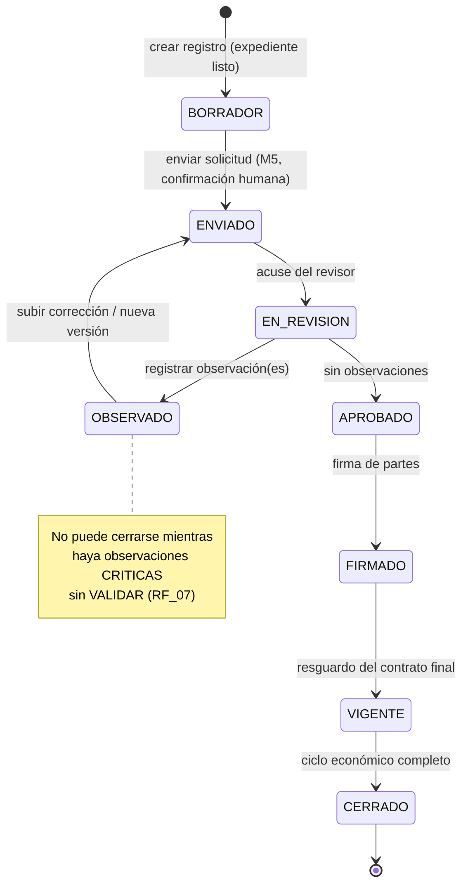
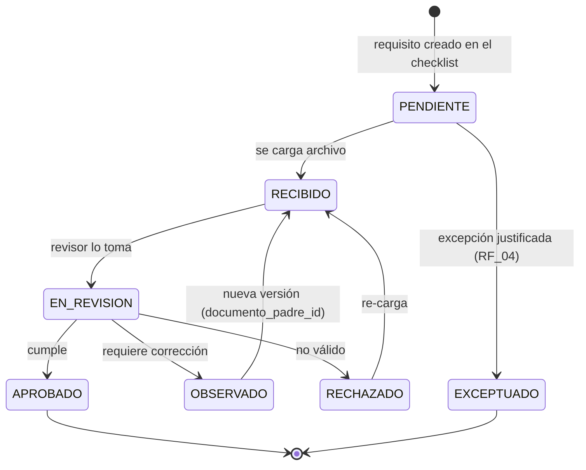
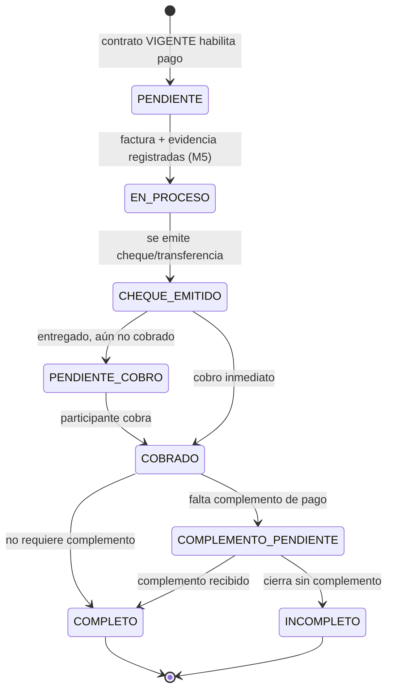
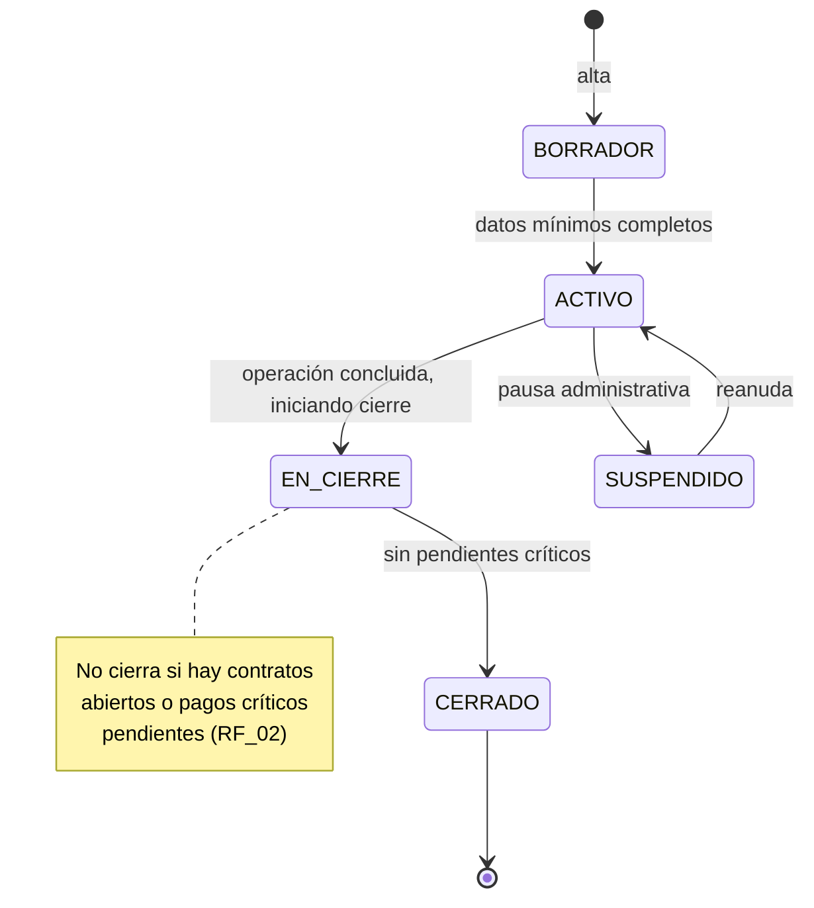
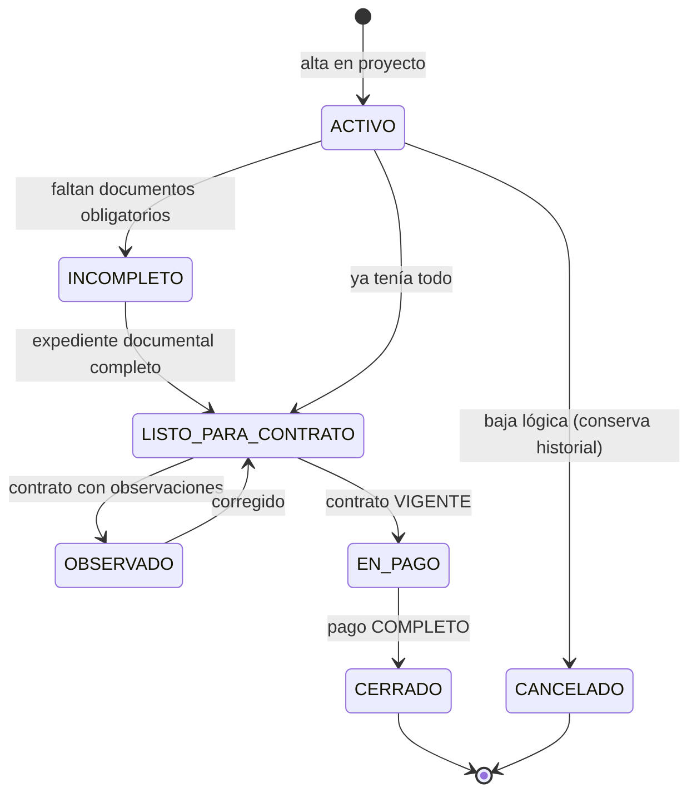

# Máquinas de estado — Módulo de honorarios

> Define las **transiciones válidas** entre estados. La base de datos fija el conjunto de
> valores (ENUM); estas máquinas fijan *qué transición se permite desde dónde* y se validan en
> la capa de negocio (RNF_04). Cada transición genera un registro en `audit_log` (RNF_01) y es
> consultable como historial (RF_14).

---

## 1. Contrato (RF_06) — la más crítica

**Reglas duras:**
- No se puede saltar de `BORRADOR` a `FIRMADO` (RNF_04): debe pasar por revisión.
- Pasar a `OBSERVADO` **exige** registrar al menos una observación (RF_06).
- El ciclo `OBSERVADO → ENVIADO → EN_REVISION` puede repetirse N veces sin perder historial.
- `VIGENTE → CERRADO` solo si el pago llegó a estado terminal (`COMPLETO`).

---

## 2. Documento / requisito documental (RF_04, RF_10)

**Regla:** una nueva versión no sobrescribe la anterior; crea un `documento` hijo y marca
`es_version_vigente`. El expediente pasa a COMPLETO solo cuando no quedan requisitos
OBLIGATORIOS fuera de `APROBADO`/`EXCEPTUADO`.

---

## 3. Pago de honorarios (RF_09)

**Reglas duras:**
- No se registra pago si el contrato no está `VIGENTE` y faltan evidencias mínimas (RF_09).
- `INCOMPLETO` (cobró pero sin complemento) **marca al participante como pendiente para
  futuras contrataciones** — dato clave que hoy genera problemas en auditoría.
- Toda transición de pago es **M5 (confirmación humana obligatoria)** — nunca automática
  (RNF_11, regla 3).

---

## 4. Proyecto (RF_02)

---

## 5. Participante (RF_03)

> **Nota de diseño:** el estado del participante es en buena medida *derivado* de sus
> componentes (expediente, contrato, pago). Se persiste para poder filtrarlo/indexarlo rápido
> (RNF_09) pero su fuente de verdad son las entidades subordinadas; se recalcula ante cada
> cambio relevante.
