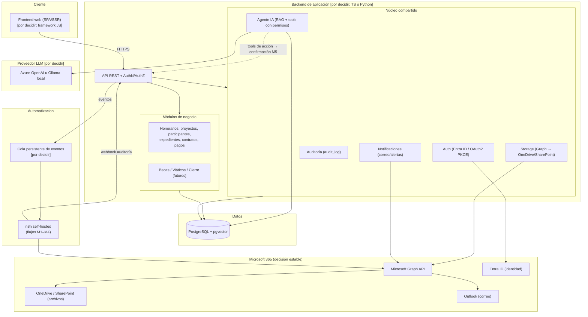

# Arquitectura lógica — Sistema de gestión administrativa UADY

> **Nivel:** lógico / conceptual. El **stack de aplicación (backend/frontend) todavía NO está
> decidido** (TypeScript vs Python vs híbrido), así que esta arquitectura describe
> **responsabilidades y capas**, no productos concretos. Las piezas que **sí** son decisión
> estable van nombradas: **PostgreSQL**, **Microsoft 365 (Graph/Entra ID/Outlook/OneDrive)**,
> **n8n**. Los "huecos" del stack se marcan como `[por decidir]`.

---

## 1. Vista de capas

---

## 2. Principios estructurales (no negociables)

1. **Núcleo compartido vs. módulos de negocio.** Las flechas de dependencia van *de* los
   módulos de negocio *hacia* el núcleo, **nunca** entre módulos de negocio (RNF_06). Agregar
   "becas" = carpeta nueva, sin tocar "honorarios".

2. **Microsoft es infraestructura consumida vía API, no la base.** Los archivos **no se
   mueven**: siguen en OneDrive/SharePoint; el sistema guarda solo la referencia + metadatos +
   hash (RNF_04). La autenticación se **delega** a Entra ID (sin contraseñas locales, RF_01).

3. **El backend es la única puerta a la IA y a los proveedores externos.** El frontend nunca
   habla directo con el LLM ni con Graph. El backend controla prompts, contexto, permisos y
   secretos (ideas_doc §9). Cambiar de proveedor LLM no debe tocar el resto.

4. **Automatización desacoplada por cola.** El backend no llama a n8n directo desde el código
   de negocio: emite un evento a una **cola persistente**; si n8n está caído, el evento no se
   pierde (RNF_08, RNF_11 M2). Esto vale con cualquier stack.

5. **Toda ejecución automática deja `source` en `audit_log`** (WEB / SYSTEM / N8N_FLOW /
   AI_AGENT) — RNF_01 + RNF_11.

6. **La IA propone, el humano dispone.** Tools de **lectura** → ejecución directa con permisos
   del usuario. Tools de **acción** → generan propuesta que espera confirmación M5 (RF_13,
   RNF_11).

---

## 3. Mecanismos de disparo (RNF_11) sobre esta arquitectura

| mecanismo | entra por | ejecuta en |
|---|---|---|
| M1 cron/barrido | Schedule de n8n / scheduler interno | n8n / backend |
| M2 webhook de evento | cola → webhook n8n | n8n |
| M3 cambio en datos | LISTEN/NOTIFY o polling | backend / n8n |
| M4 correo entrante | Graph change notifications + polling de respaldo | n8n |
| M5 manual/confirmación | botón → endpoint | backend (→ n8n) |
| M6 tool del agente | módulo IA | backend |

---

## 4. Qué está decidido y qué no (para el siguiente paso)

**Decidido / estable:**
- Base de datos relacional + vectorial: **PostgreSQL + pgvector**.
- Ecosistema documental, correo e identidad: **Microsoft 365 vía Graph + Entra ID**.
- Motor de automatización: **n8n self-hosted**.
- Modelo multi-tenant, RBAC, auditoría, cifrado de PII, mecanismos M1–M6.

**Por decidir (bloquea empezar a codear, no a diseñar):**
- Lenguaje/framework de **backend** (TypeScript/NestJS vs Python/FastAPI vs híbrido).
- Framework de **frontend** (probablemente Next.js, pero atado a la decisión anterior si se
  comparte lenguaje).
- **Proveedor LLM** (Azure OpenAI vs Ollama local) — depende de presupuesto e infraestructura.
- Tecnología de **cola** de eventos (depende del lenguaje elegido).

> Cuando quieras cerrar el stack, puedo hacer un análisis comparativo TS vs Python vs híbrido
> **específico para este dominio** (peso de la parte administrativa vs. la parte de IA/OCR
> documental), que es exactamente el criterio que tú mismo planteaste en `ideas_doc §6`.
