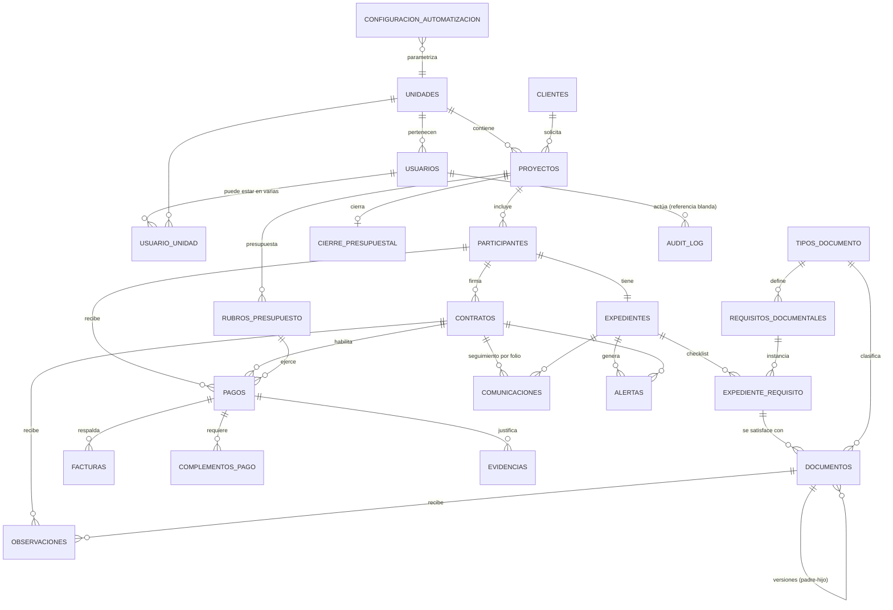

# Modelo de datos — Módulo de honorarios

> **Alcance:** primer módulo del sistema (honorarios en FMAT), diseñado multi-tenant y
> extensible a otros módulos y facultades.
> **Agnóstico al stack de aplicación:** el backend (TypeScript vs Python) todavía no está
> decidido. Este modelo se define sobre **PostgreSQL**, que sí es decisión estable. No usa
> ninguna característica atada a un ORM concreto.
> **Convención:** nombres de tabla en `snake_case` plural, claves primarias `UUID`, todas las
> tablas de negocio llevan `unidad_id`, `created_at`, `updated_at` y `deleted_at` (soft delete).

---

## 1. Decisiones de modelado (y por qué)

Estas son decisiones que tomé al construir el modelo. Las marco explícitamente porque no
estaban todas detalladas en los requisitos.

1. **Multi-tenancy por columna `unidad_id`** (no una base por facultad). Lo pide RNF_06 y es
   lo correcto: una sola instancia, filtro obligatorio por unidad en cada consulta, y agregar
   facultad = insertar un registro en `unidades`, no desplegar infraestructura.

2. **`expediente` es una entidad real, no solo una vista.** RF_05 deja abierto si es entidad o
   vista consolidada. La modelo como tabla porque necesito colgar de ella el checklist
   documental, el estado agregado y la línea de tiempo, y porque da un ancla estable de
   permisos (el INVESTIGADOR ve *su* expediente). La *presentación* del expediente sí es una
   agregación en tiempo de lectura, pero su identidad persiste.

3. **Separo catálogo de instancia en documentos.** `tipos_documento` (catálogo reutilizable) →
   `requisitos_documentales` (qué exige un flujo) → `expediente_requisito` (el checklist de un
   participante concreto) → `documentos` (el archivo real cargado). Esto permite cambiar la
   política documental sin tocar expedientes viejos (RF_04) y saber exactamente qué falta.

4. **Versionado de documentos por auto-referencia**, no por tabla aparte: `documentos` tiene
   `documento_padre_id` y `es_version_vigente`. Solo una versión vigente por requisito; las
   anteriores quedan en historial (RF_07, RF_10). Evita "una versión que se pierde en Word".

5. **El estado es un `ENUM` de PostgreSQL, no texto libre.** Integridad a nivel de base
   (RNF_04). Las *transiciones* válidas se validan en la capa de negocio (máquina de estados),
   pero el conjunto de valores lo fija la base.

6. **`audit_log` sin FK dura hacia las entidades.** Debe sobrevivir al soft-delete de la
   entidad original y ser inmutable (RNF_01). Referencia por `entity_type` + `entity_id`.

7. **PII cifrada a nivel de columna** (`BYTEA` con pgcrypto): `rfc`, `curp`, `clabe`,
   `cuenta_bancaria`, `ine`, `domicilio` (RNF_07). El modelo marca esas columnas; la llave vive
   fuera de la base.

8. **Comunicaciones por folio como entidad de primera clase** (RF_08). El correo (Outlook) es
   solo canal; la verdad operativa vive en `comunicaciones`, ligada a un `folio`.

---

## 2. Diagrama entidad-relación



> Nota: `AUDIT_LOG` y `CONFIGURACION_AUTOMATIZACION` se relacionan de forma lógica con casi
> todas las entidades; se dibujan aparte para no saturar el diagrama.

---

## 3. Diccionario de entidades

### 3.1 Núcleo compartido (sirve a todos los módulos)

#### `unidades` — facultad / tenant
| campo | tipo | notas |
|---|---|---|
| id | UUID PK | |
| nombre | TEXT | "FMAT", "FING"… |
| codigo | TEXT UNIQUE | código corto |
| configuracion | JSONB | módulos activos, reglas por unidad |
| activa | BOOLEAN | |
| created_at / updated_at | TIMESTAMPTZ | |

#### `usuarios`
| campo | tipo | notas |
|---|---|---|
| id | UUID PK | |
| entra_oid | TEXT UNIQUE | object id de Microsoft Entra ID |
| email | TEXT UNIQUE | correo institucional |
| nombre | TEXT | |
| rol | ENUM `rol_usuario` | ADMIN, SECRETARIA, DIRECTOR, INVESTIGADOR, REVISOR_EXTERNO |
| unidad_id | UUID FK → unidades | unidad principal |
| activo | BOOLEAN | bloqueo sin borrar historial (RF_01) |
| participante_id | UUID FK → participantes NULL | vincula un usuario INVESTIGADOR con su propio expediente |

> **Decisión:** `usuarios.participante_id` conecta la identidad de login con la persona del
> expediente, para que el `OwnershipGuard` (RNF_02) sepa qué expediente es "el propio".

#### `usuario_unidad` — pertenencia múltiple (opcional)
Para un administrador central que opera varias facultades (RF_01, RNF_06). PK compuesta
(`usuario_id`, `unidad_id`).

#### `audit_log` — trazabilidad inmutable (RNF_01)
| campo | tipo | notas |
|---|---|---|
| id | UUID PK | |
| entity_type | TEXT | "Contrato", "Documento"… |
| entity_id | UUID | referencia blanda (sin FK dura) |
| action | ENUM | CREATED, UPDATED, STATE_CHANGED, DELETED, SENSITIVE_DATA_ACCESS |
| user_id | UUID NULL | null en acciones de sistema |
| source | ENUM | WEB, AI_AGENT, N8N_FLOW, SYSTEM |
| previous | JSONB | estado anterior relevante |
| next | JSONB | estado nuevo relevante |
| metadata | JSONB | ip, nombre de flujo n8n, etc. |
| created_at | TIMESTAMPTZ | UTC, precisión ms |

> Sin endpoints UPDATE/DELETE. Solo INSERT y SELECT.

#### `configuracion_automatizacion` (RNF_11)
Umbrales (24/48/72h), ventana laboral, frecuencias de barrido por nivel, por `unidad_id`.
Nunca hardcodeado.

---

### 3.2 Proyecto y presupuesto

#### `clientes`
Entidad solicitante externa (ayuntamiento, empresa, dependencia). Separada para reutilizarse
entre proyectos. Campos: `id`, `nombre`, `tipo`, `contacto`, `unidad_id`.

#### `proyectos` (RF_02)
| campo | tipo | notas |
|---|---|---|
| id | UUID PK | |
| unidad_id | UUID FK | |
| folio_interno | TEXT | único por unidad |
| nombre | TEXT | |
| cliente_id | UUID FK → clientes | |
| descripcion | TEXT | |
| responsable_id | UUID FK → usuarios | responsable académico/administrativo |
| fecha_inicio / fecha_fin | DATE | |
| monto_aprobado | NUMERIC(14,2) | |
| estado | ENUM `estado_proyecto` | ver §4 |
| created_at / updated_at / deleted_at | TIMESTAMPTZ | |

#### `rubros_presupuesto`
Desglose del presupuesto por rubro (honorarios, viáticos, materiales, servicios…). Campos:
`id`, `proyecto_id`, `nombre_rubro`, `monto_estimado`, `monto_ejercido` (calculado). Base del
cierre presupuestal (RF_09 / cierre).

#### `cierre_presupuestal`
Uno por proyecto. Consolida estimado vs. ejercido con respaldo documental. Campos: `id`,
`proyecto_id`, `estado`, `fecha_cierre`, `total_estimado`, `total_ejercido`, `observaciones`.

---

### 3.3 Participante y expediente

#### `participantes` (RF_03)
| campo | tipo | notas |
|---|---|---|
| id | UUID PK | |
| unidad_id | UUID FK | |
| proyecto_id | UUID FK → proyectos | |
| nombre | TEXT | |
| email | TEXT | |
| tipo | ENUM `tipo_participante` | HONORARIOS, BECA |
| rol_actividad | TEXT | actividad en el proyecto |
| periodo_inicio / periodo_fin | DATE | |
| monto_a_pagar | NUMERIC(14,2) | |
| responsable_valida_id | UUID FK → usuarios | |
| estado | ENUM `estado_participante` | ver §4 |
| **rfc** | BYTEA | 🔒 cifrado (RNF_07) |
| **curp** | BYTEA | 🔒 cifrado |
| **clabe** | BYTEA | 🔒 cifrado |
| **cuenta_bancaria** | BYTEA | 🔒 cifrado |
| **ine** | BYTEA | 🔒 cifrado |
| **domicilio** | BYTEA | 🔒 cifrado |

> **Decisión anti-duplicado:** para reutilizar una persona entre proyectos (RF_03) sin duplicar
> datos fiscales, se detecta coincidencia por hash del RFC. A futuro puede extraerse una entidad
> `personas` (datos fiscales únicos) separada de `participantes` (participación en un proyecto).
> Lo dejo señalado pero no lo fuerzo aún para no sobre-diseñar el primer módulo.

#### `expedientes` (RF_05)
Uno por participante. `id`, `participante_id` (UNIQUE), `unidad_id`, `estado_documental`
(calculado: INCOMPLETO / COMPLETO), `etapa_actual` (ENUM: DOCUMENTACION, CONTRATO, PAGO,
CIERRE), `created_at`.

---

### 3.4 Documentos

#### `tipos_documento` (catálogo, RF_04)
`id`, `unidad_id` (o global), `nombre` ("Identificación", "Cotización", "Contrato",
"Factura PDF", "Factura XML", "Evidencia", "Complemento de pago"), `descripcion`.

#### `requisitos_documentales`
Qué documentos exige un flujo. `id`, `tipo_documento_id`, `tipo_participante`,
`obligatoriedad` (ENUM: OBLIGATORIO, OPCIONAL, CONDICIONAL), `condicion` (JSONB, para
condicionales), `unidad_id`.

#### `expediente_requisito` (checklist instanciado)
`id`, `expediente_id`, `requisito_documental_id`, `estado` (ENUM: PENDIENTE, RECIBIDO,
EN_REVISION, OBSERVADO, APROBADO, RECHAZADO, EXCEPTUADO), `exceptuado_por_id`,
`justificacion_excepcion`. El estado del expediente se recalcula desde aquí.

#### `documentos` (RF_10)
| campo | tipo | notas |
|---|---|---|
| id | UUID PK | |
| unidad_id | UUID FK | |
| expediente_requisito_id | UUID FK NULL | null si es documento libre/complementario |
| tipo_documento_id | UUID FK | |
| nombre_archivo | TEXT | |
| sharepoint_drive_id | TEXT | ubicación real en OneDrive/SharePoint (Graph) |
| sharepoint_item_id | TEXT | el archivo NO se mueve, solo se referencia |
| hash_sha256 | TEXT | firma de integridad al registrar (RNF_04) |
| estado | ENUM `estado_documento` | |
| documento_padre_id | UUID FK NULL → documentos | versión anterior |
| es_version_vigente | BOOLEAN | solo una vigente por requisito |
| subido_por_id | UUID FK → usuarios | |
| created_at | TIMESTAMPTZ | |

---

### 3.5 Contrato, observaciones y comunicaciones

#### `contratos` (RF_06)
| campo | tipo | notas |
|---|---|---|
| id | UUID PK | |
| unidad_id / proyecto_id / participante_id | UUID FK | |
| folio | TEXT | identificador operativo, ej. CONTRATO-2026-014 |
| estado | ENUM `estado_contrato` | máquina de estados §4 |
| fecha_solicitud / fecha_firma | TIMESTAMPTZ | |
| documento_vigente_id | UUID FK NULL → documentos | versión actual del contrato |

> El **historial** de transiciones no se guarda como columna: se reconstruye desde `audit_log`
> (RNF_01 + RF_14). Evita duplicar la fuente de verdad.

#### `observaciones` (RF_07)
`id`, `contrato_id` NULL, `documento_id` NULL (una de las dos), `descripcion`, `severidad`
(ENUM: CRITICA, MENOR), `estado` (ENUM: PENDIENTE, ATENDIDA, VALIDADA, DESCARTADA),
`justificacion_descartada`, `creada_por_id`, `resuelta_por_id`, `documento_correccion_id`
(la versión que respondió a la observación).

#### `comunicaciones` (RF_08)
`id`, `folio`, `contrato_id` NULL, `expediente_id` NULL, `direccion` (ENUM: ENVIADO,
RECIBIDO), `asunto`, `fecha`, `remitente`, `mensaje_graph_id` (referencia al correo en
Outlook), `estado_seguimiento` (ENUM: EN_REVISION, CON_OBSERVACIONES, PENDIENTE_DOCUMENTOS,
REENVIADO, APROBADO, CERRADO, VENCIDO), `asociada_manualmente` (BOOLEAN, cuando no se
reconoció el folio).

---

### 3.6 Pago y cierre

#### `pagos` (RF_09)
| campo | tipo | notas |
|---|---|---|
| id | UUID PK | |
| unidad_id / participante_id / contrato_id | UUID FK | |
| rubro_presupuesto_id | UUID FK NULL | para el cierre presupuestal |
| **importe** | NUMERIC(14,2) | dato financiero sensible (RNF_07 medio) |
| estado | ENUM `estado_pago` | §4 |
| medio_pago | ENUM | CHEQUE, TRANSFERENCIA |
| fecha_emision / fecha_cobro | TIMESTAMPTZ | cheque puede no cobrarse de inmediato |

#### `facturas`
`id`, `pago_id`, `folio_fiscal_uuid`, `sharepoint_item_id_pdf`, `sharepoint_item_id_xml`,
`importe`, `estado`.

#### `complementos_pago`
`id`, `pago_id`, `estado` (PENDIENTE, RECIBIDO), `sharepoint_item_id`. Su ausencia marca al
participante como "pendiente para futuras contrataciones" (RF_09).

#### `evidencias`
`id`, `pago_id` NULL, `contrato_id` NULL, `descripcion`, `sharepoint_item_id`, `estado`.

---

### 3.7 Alertas / pendientes

#### `alertas` (RF_11)
`id`, `unidad_id`, `entity_type`, `entity_id`, `tipo` (SIN_MOVIMIENTO, DOC_FALTANTE,
OBSERVACION_ABIERTA, PAGO_PENDIENTE, COMPLEMENTO_PENDIENTE), `severidad` (NORMAL, CRITICA),
`responsable_id`, `estado` (ACTIVA, ATENDIDA, DESCARTADA, ESCALADA), `justificacion`,
`created_at`. Idempotente por diseño (no duplicar alerta del mismo evento — RNF_11).

---

## 4. Enumeraciones y estados

```
rol_usuario:        ADMIN | SECRETARIA | DIRECTOR | INVESTIGADOR | REVISOR_EXTERNO
tipo_participante:  HONORARIOS | BECA
estado_proyecto:    BORRADOR | ACTIVO | EN_CIERRE | CERRADO | SUSPENDIDO
estado_participante:ACTIVO | INCOMPLETO | OBSERVADO | LISTO_PARA_CONTRATO | EN_PAGO | CERRADO | CANCELADO
estado_documento:   PENDIENTE | RECIBIDO | EN_REVISION | OBSERVADO | APROBADO | RECHAZADO | EXCEPTUADO
estado_contrato:    BORRADOR | ENVIADO | EN_REVISION | OBSERVADO | APROBADO | FIRMADO | VIGENTE | CERRADO
estado_pago:        PENDIENTE | EN_PROCESO | CHEQUE_EMITIDO | PENDIENTE_COBRO | COBRADO | COMPLEMENTO_PENDIENTE | COMPLETO | INCOMPLETO
estado_observacion: PENDIENTE | ATENDIDA | VALIDADA | DESCARTADA
```

Las **transiciones válidas** entre estos estados están en
[`diagramas/02_maquinas_de_estado.md`](diagramas/02_maquinas_de_estado.md).

---

## 5. Integridad, borrado y trazabilidad (resumen operativo)

- **Soft delete** en todas las entidades de negocio (`deleted_at`). Nunca hard delete
  (RNF_04): preserva integridad referencial e historial.
- **FK con `ON DELETE RESTRICT`** en relaciones críticas (no se borra un proyecto con
  contratos).
- **Transacciones** para operaciones multi-entidad (registrar pago = pago + estado contrato +
  audit, todo o nada).
- **`audit_log`** captura toda escritura sobre entidades críticas; el historial visible
  (RF_14) se lee de ahí.

---

## 6. Pendientes de definición (para no adivinar)

Estos puntos no están cerrados en los requisitos y conviene decidirlos antes de implementar:

1. **[RESUELTO — diferir]** Entidad `personas` (datos fiscales únicos) NO se extrae en el MVP.
   Los duplicados entre proyectos se resuelven por hash del RFC (como ya está modelado). Se
   extraerá solo cuando una misma persona aparezca de forma recurrente entre proyectos.
2. **[RESUELTO — por unidad]** El `folio` de contrato es **único por unidad**
   (`UNIQUE(unidad_id, folio)`), coherente con RF_08 y el diseño multi-tenant.
3. **[RESUELTO]** Retención de PII: **5 años**, contados desde el cierre de la relación con el
   proyecto / último ejercicio fiscal (no desde la creación del registro). Alineado con la
   retención fiscal mexicana (CFF art. 30). El "borrado" se implementa como **crypto-erasure**
   (destruir la llave del registro + `NULL` en las columnas `BYTEA`), no `DELETE`, para no
   romper el soft-delete ni el `audit_log` inmutable. Detalle en RNF_07.
4. **[RESUELTO]** Cadencia del barrido n8n: se adopta el consenso de RNF_11 como definitivo —
   **crítico 1h laboral / diario 7:00 / nocturno 2:00**, umbrales configurables por unidad.
   Justificación en `ideas/preguntas.md`.
