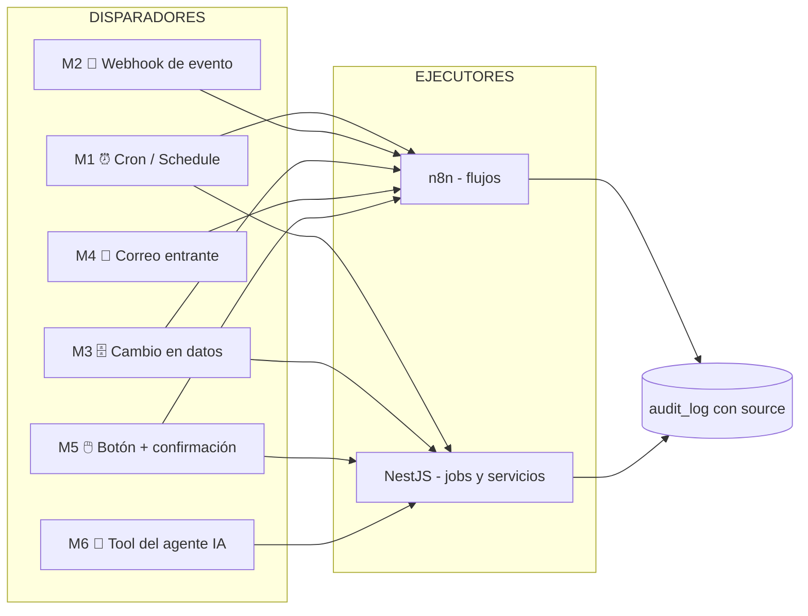

# RNF_11 — Mecanismos de ejecución y disparo de automatizaciones

## por qué existe este requisito en este sistema

El sistema no es solo un repositorio de datos: es una plataforma que ejecuta flujos, scripts y reglas de negocio. Los requisitos funcionales ya describen esas automatizaciones (RF_08 seguimiento por folio, RF_09 control de pago, RF_11 alertas y recordatorios, RF_13 asistente de IA), pero ninguno define **quién las dispara ni cómo**. 

El problema de fondo es simple pero crítico: **ninguna automatización se ejecuta sola**. Toda automatización necesita un disparador. Si no se define con qué mecanismo se dispara cada flujo o script, ocurren tres cosas malas:

- el personal termina ejecutando los procesos a mano (que es justo el dolor que el sistema busca eliminar);
- se mezcla la lógica en lugares inconsistentes (mismo proceso disparado a veces por n8n, a veces por el backend), lo que rompe la trazabilidad de RNF_01;
- nadie sabe con qué frecuencia ni bajo qué condición corre cada cosa, y los vencimientos se escapan.

Este requisito existe para **fijar un consenso**: cuáles son los mecanismos de disparo autorizados, cómo funciona cada uno, y qué automatización del sistema usa cuál. No es una lista de opciones abierta: es una decisión de diseño cerrada que el resto del sistema debe respetar.

Este es un requisito no funcional porque no describe una función nueva para el usuario, sino una **propiedad transversal de arquitectura**: la forma estándar en que el sistema dispara y ejecuta su propia automatización.

---

## descripción del requisito

Toda automatización del sistema (flujo, script o regla programada) debe estar asociada a **uno y solo uno** de los mecanismos de disparo autorizados definidos en este documento. No se permite ejecutar lógica crítica "a mano" como parte normal de la operación, ni inventar mecanismos de disparo fuera de los aquí establecidos.

El sistema adopta el modelo **disparador + acción**: cada automatización se compone de un evento que la inicia (el disparador o *trigger*) y una secuencia de pasos que ejecuta (la acción). Este requisito define los disparadores; las acciones ya están descritas en los requisitos funcionales correspondientes.

El grado de automatización se entiende como un espectro y cada automatización debe declarar dónde cae:

```
MANUAL  ─────────────  SEMI-AUTOMÁTICO  ─────────────  AUTOMÁTICO
un humano          el sistema prepara todo y          el sistema
inicia la acción   un humano solo confirma            actúa solo
```

Se definen **seis mecanismos de disparo** como el conjunto cerrado y autorizado:

| id | mecanismo | naturaleza |
|---|---|---|
| M1 | programado por tiempo (cron / barrido) | automático |
| M2 | por evento del backend (webhook) | automático |
| M3 | por cambio de estado en datos (polling / LISTEN-NOTIFY) | automático |
| M4 | por correo entrante (Microsoft Graph) | automático |
| M5 | manual / semi-automático (UI + confirmación) | semi-automático / manual |
| M6 | por el agente de IA (tool call) | semi-automático (con confirmación) |

---

## modelo conceptual del disparo



La regla estructural es: **el disparador decide _cuándo_ se ejecuta; el ejecutor (n8n o NestJS) decide _qué_ se ejecuta; y toda ejecución automática deja registro en `audit_log` con su `source`** (alineado con RNF_01).

---

## los seis mecanismos de disparo (consenso detallado)

Para cada mecanismo se define: qué lo dispara, la **decisión adoptada** sobre el método de disparo, dónde vive, su latencia/frecuencia, su manejo de error y a qué requisitos funcionales sirve. Las decisiones marcadas como **[CONSENSO]** son cerradas y obligatorias.

---

### M1 — Disparador programado por tiempo (cron / barrido)

**Qué lo dispara:** el paso del tiempo. El sistema ejecuta la acción según un calendario fijo, sin intervención humana ni evento previo.

**Para qué se usa:** detectar lo que *no pasó* (ausencias) y tareas de mantenimiento recurrente.
- RF_11 — detectar contratos sin movimiento en 24/48/72h.
- RF_08 — revisar hilos de correo sin respuesta.
- RF_09 — recordar complementos de pago pendientes.
- scripts de mantenimiento — normalización de nombres de documentos, mapeo de carpetas de OneDrive, reportes semanales.

**[CONSENSO] método de disparo adoptado:**

- El "barrido" no es un único proceso global. Se divide en **tres niveles de frecuencia** según urgencia, y todos los umbrales son **configurables en base de datos**, nunca hardcodeados:

  | nivel | cuándo corre | qué revisa |
  |---|---|---|
  | crítico | cada 1 hora, solo en horario laboral (L–V 7:00–20:00) | contratos/observaciones vencidos, correos sin respuesta > umbral |
  | diario | una vez al día a las 7:00 (antes de jornada) | expedientes incompletos, pagos y complementos pendientes, semáforos |
  | nocturno | una vez al día a las 2:00 | scripts de mantenimiento, normalización de documentos, reportes |

- **El motor de cron es n8n** (nodo Schedule Trigger) para los flujos que tocan correo, notificaciones o sistemas externos. Se usa **`@nestjs/schedule`** únicamente para tareas que recalculan estado interno del sistema (ej. recálculo de indicadores del dashboard de RF_12) y no salen del backend.
- El horario laboral es **parámetro configurable**, no constante de código (coherente con RNF_03, que ya define la ventana L–V 7:00–20:00).

**Manejo de error:** si un barrido falla, n8n notifica al administrador antes de reintentar (no falla en silencio, igual que exige RNF_03). Cada barrido es **idempotente**: volver a correrlo no genera alertas duplicadas (ver convención de idempotencia más abajo).

**Latencia:** de minutos a 24h según el nivel. No es para nada que requiera reacción inmediata.

---

### M2 — Disparador por evento del backend (webhook)

**Qué lo dispara:** algo cambió en el sistema y el backend **avisa activamente** al ejecutor en el mismo instante. Es el patrón ya descrito en las ideas del proyecto: *"tu backend dispara un evento, n8n lo recibe y ejecuta el flujo"*.

**Para qué se usa:** reaccionar al instante a una acción real del usuario.
- RF_03 — se registra un participante → flujo que calcula documentos faltantes y notifica.
- RF_06 — un contrato pasa a "observado" → correo automático al responsable.
- RF_10 — se sube un documento → script que valida nombre y formato.

**[CONSENSO] método de disparo adoptado:**

- El backend **no llama a n8n directamente desde el código de negocio**. Emite un evento de dominio interno (`EventEmitter2`) que se encola en **BullMQ**; un *worker* consume la cola y hace la llamada HTTP al **Webhook node de n8n**. Esto garantiza que si n8n está caído, el evento no se pierde: queda en la cola y se reintenta (apoya la recuperabilidad de RNF_08).
- El webhook de n8n se protege con un **token secreto compartido**; n8n rechaza cualquier disparo sin ese token (coherente con la seguridad de RNF_02).
- Todo evento que dispara un flujo debe escribir su origen en `audit_log` con `source: 'WEB'` (si lo originó un usuario) o `source: 'SYSTEM'`, y el flujo de n8n cierra con un nodo que registra `source: 'N8N_FLOW'` con el nombre del flujo (exactamente como pide RNF_01).

**Manejo de error:** la cola BullMQ reintenta con backoff; tras N reintentos fallidos, marca el job como fallido y notifica al administrador.

**Latencia:** segundos. Es el mecanismo para "reacción inmediata".

---

### M3 — Disparador por cambio de estado en datos (polling / LISTEN-NOTIFY)

**Qué lo dispara:** un cambio en una fila de la base de datos, detectado sin que el backend tenga que avisar explícitamente.

**Para qué se usa:** casos donde la condición de disparo es una **consulta sobre datos**, no un evento puntual (ej. "todos los contratos en estado `enviado` con `updated_at` mayor a 48h").

**[CONSENSO] método de disparo adoptado:**

- **El mecanismo preferente es M2 (evento del backend), no M3.** M3 se reserva para dos casos concretos:
  1. detectar **ausencia** de algo (lo que no ocurrió), que por definición no genera un evento — y eso se resuelve combinándolo con M1 (un barrido que consulta la condición).
  2. integraciones donde no es práctico emitir evento desde el backend.
- **No se usan triggers SQL para lógica de negocio.** Los triggers de PostgreSQL se permiten únicamente para integridad de datos (apoyo a RNF_04), nunca para disparar flujos o efectos de negocio, porque rompen la trazabilidad y esconden lógica fuera del backend.
- Cuando se necesite reacción en tiempo real a un cambio de datos sin pasar por el código de negocio, se usa **`LISTEN/NOTIFY` de PostgreSQL** escuchado por el backend; el **polling** (n8n consultando cada X minutos) queda como opción simple para arrancar y para detección de ausencias.

**Manejo de error:** el polling es idempotente por diseño (consulta condición, no consume evento). `LISTEN/NOTIFY` se complementa siempre con un barrido M1 de respaldo, porque una notificación perdida durante una caída no se recupera sola.

**Latencia:** de tiempo real (LISTEN/NOTIFY) a minutos (polling).

---

### M4 — Disparador por correo entrante (Microsoft Graph)

**Qué lo dispara:** la llegada de un correo a la bandeja institucional. Es central porque medio proceso administrativo vive en correo (RF_08).

**Para qué se usa:**
- RF_08 — llega correo con folio (`CONTRATO-2026-014`) en el asunto → se asocia al folio → actualiza estado del contrato → registra evento.
- detección de respuestas en hilos de seguimiento.

**[CONSENSO] método de disparo adoptado:**

- El mecanismo principal son las **Change Notifications (subscriptions/webhooks) de Microsoft Graph**: Graph avisa al sistema cuando llega un correo relevante. Es la opción de disparo en tiempo real.
- Como las subscriptions de Graph **expiran y pueden perder notificaciones**, se establece como obligatorio un **respaldo por polling (M1, nivel crítico)** que cada hora revisa la bandeja por folios no procesados. Decisión cerrada: **M4 nunca va solo, siempre con barrido de respaldo.**
- El reconocimiento del folio se hace por **patrón en el asunto**. Si un correo no trae folio reconocible, no se descarta: queda en una bandeja de "sin asociar" para vinculación manual (esto ya está previsto en el flujo alterno de RF_08).
- Toda actualización de estado originada por correo se audita con `source: 'N8N_FLOW'` y el nombre del flujo.

**Manejo de error:** correo no reconocido → bandeja manual, no se pierde. Subscription caída → la cubre el polling de respaldo.

**Latencia:** segundos (notificación) con red de seguridad de 1h (polling).

---

### M5 — Disparador manual / semi-automático (UI + confirmación)

**Qué lo dispara:** un humano que hace clic en la interfaz. **No es una deficiencia: en varios procesos es obligatorio por diseño.** Las propias notas del proyecto lo dejan claro:

> RF_06 (nota): "aunque quiere hacerlo lo más automático posible, no se puede, porque siempre habrá que enviar la solicitud y que un independiente... mande el doc"
> ideas_doc 11.2: "No dejar que la IA decida procesos críticos por sí sola"

**Para qué se usa:** toda acción crítica, externa o irreversible.
- enviar la solicitud de contrato (RF_06): el sistema **prepara** el correo (folio, datos del participante, plantilla) y la secretaría solo **revisa y confirma**.
- cerrar un proyecto (RF_02): botón que dispara la validación de pendientes antes de cerrar.
- enviar cualquier correo oficial.

**[CONSENSO] método de disparo adoptado:**

- Patrón obligatorio para acciones críticas: **"el sistema deja todo listo, el humano solo aprueba"**. El sistema automatiza la preparación (el 90%); el humano aporta únicamente el consentimiento (el 10%). Eso es semi-automático, y es el modo por defecto para cualquier acción que salga del sistema o cambie dinero/estado legal.
- El disparo va: botón en Next.js → endpoint en NestJS → (si aplica) webhook a n8n (reusa M2). O sea, M5 **reutiliza la infraestructura de M2** una vez que el humano confirma.
- Decisión cerrada: **ninguna acción de las categorías "envío de correo oficial", "cambio de estado de pago" o "cierre de proyecto" puede dispararse de forma totalmente automática (M1–M4).** Siempre pasan por M5 o por confirmación equivalente.

**Manejo de error:** validaciones previas al clic (no se habilita el botón si faltan precondiciones); el endpoint revalida en el backend antes de ejecutar.

**Latencia:** la que decida el humano.

---

### M6 — Disparador por el agente de IA (tool call)

**Qué lo dispara:** el asistente de IA (RF_13) decide llamar una herramienta (*tool*) del backend para consultar datos o ejecutar una acción autorizada.

**Para qué se usa:**
- consultar estado, faltantes, resúmenes (lectura) → ejecución directa.
- proponer o preparar una acción (redactar correo, sugerir siguiente paso) → entrega un borrador.

**[CONSENSO] método de disparo adoptado:**

- Las *tools* del agente se clasifican en **dos tipos**, y esta separación es obligatoria:
  - **tools de lectura** (consultar expediente, listar faltantes, buscar en documentos): el agente las ejecuta directamente, sujetas siempre a los permisos del usuario autenticado (RNF_02, RF_13).
  - **tools de acción** (enviar correo, cambiar estado, registrar pago): el agente **nunca las ejecuta solo**. Produce una propuesta y la deja lista para que el usuario la confirme vía M5. El agente cae, para acciones, en la categoría semi-automática.
- Toda ejecución originada por el agente se audita con `source: 'AI_AGENT'` (ya contemplado en RNF_01).
- El agente vive como módulo `ai` dentro de NestJS y llama a los mismos servicios internos que el resto del backend; no tiene un canal de ejecución privilegiado ni paralelo.

**Manejo de error:** si una tool de lectura falla o el dato no existe, el agente responde que no encontró información, no inventa (regla ya fijada en RF_13).

**Latencia:** la de la conversación; las acciones esperan confirmación humana.

---

## tabla de consenso: automatización → mecanismo asignado

Esta tabla es la **fuente de verdad** sobre cómo se dispara cada automatización del sistema. Toda automatización nueva debe agregarse aquí con su mecanismo decidido.

| automatización | RF/RNF | mecanismo | frecuencia / latencia | ejecutor | ¿confirmación humana? |
|---|---|---|---|---|---|
| detectar contrato sin movimiento 24/48/72h | RF_11 | M1 crítico | cada 1h laboral | n8n | no (solo alerta) |
| recordatorio de complemento de pago | RF_09 | M1 diario | 1×/día 7:00 | n8n | no (solo alerta) |
| normalizar nombres de documentos | scripts | M1 nocturno + M2 al subir | nocturno / inmediato | n8n + BullMQ | no |
| mapear carpetas de OneDrive | scripts | M1 nocturno | 1×/día 2:00 | n8n | no |
| calcular faltantes al alta de participante | RF_03/RF_04 | M2 | segundos | NestJS → n8n | no |
| correo automático al observar contrato | RF_06 | M2 | segundos | n8n | no (es notificación) |
| validar formato al subir documento | RF_10 | M2 | segundos | BullMQ (NestJS) | no |
| asociar correo entrante por folio | RF_08 | M4 + M1 respaldo | segundos / 1h | n8n | no (asociación) |
| recálculo de indicadores del dashboard | RF_12 | M1 diario | 1×/día | NestJS @nestjs/schedule | no |
| **enviar solicitud de contrato** | RF_06 | **M5** | a decisión del usuario | NestJS → n8n | **sí, obligatorio** |
| **cerrar proyecto** | RF_02 | **M5** | a decisión del usuario | NestJS | **sí, obligatorio** |
| **registrar/avanzar pago** | RF_09 | **M5** | a decisión del usuario | NestJS | **sí, obligatorio** |
| consultar estado / faltantes / resumen | RF_13 | M6 lectura | conversacional | NestJS (módulo ai) | no |
| **redactar correo / proponer acción** | RF_13 | **M6 acción → M5** | conversacional | NestJS (módulo ai) | **sí, obligatorio** |
| proponer clasificación de adjuntos entrantes | RF_15 | M4 (propuesta) | segundos | n8n → NestJS | — (solo propone) |
| **confirmar clasificación de adjunto** | RF_15 | **M5** | a decisión del usuario | NestJS | **sí, obligatorio** |
| validar y registrar subida por enlace tokenizado | RF_15 fase 2 | M2 | segundos | NestJS (BullMQ) | no (el token acota) |
| pasar contrato APROBADO → VOBO_DIRECCION y notificar | RF_16 | M2 | segundos | NestJS → n8n | no (es transición+aviso) |
| **otorgar / devolver visto bueno** | RF_16 | **M5** | a decisión del Director | NestJS | **sí, obligatorio** |
| recordatorio de VoBo sin atender (>48h config.) | RF_16 | M1 crítico | cada 1h laboral | n8n | no (solo alerta) |

---

## reglas de negocio y convenciones obligatorias (el consenso)

1. **Disparador único declarado.** Toda automatización usa exactamente uno de los seis mecanismos (M1–M6) y lo declara en la tabla de consenso. No se permiten mecanismos fuera de esta lista.
2. **Reacción inmediata = M2; ausencia = M1.** Si la condición es "algo pasó", se dispara por evento (M2). Si la condición es "algo no pasó / lleva X tiempo sin pasar", se dispara por barrido (M1). No se simula uno con el otro.
3. **Acciones críticas siempre semi-automáticas.** Envío de correo oficial, cambio de estado de pago y cierre de proyecto solo pueden dispararse por M5 (o M6→M5). Nunca por M1–M4 de forma totalmente automática.
4. **Un solo ejecutor por acción.** Cada efecto de negocio se ejecuta en un solo lugar (n8n o NestJS), nunca duplicado en ambos, para no romper la trazabilidad ni causar dobles ejecuciones.
5. **Toda ejecución automática se audita con `source`.** `WEB`, `SYSTEM`, `N8N_FLOW`, `AI_AGENT` (alineado con RNF_01). Si un flujo actuó solo, debe poder responderse "qué flujo, cuándo y por qué".
6. **Idempotencia.** Repetir un disparo (por reintento o solapamiento de barridos) no debe duplicar alertas, correos ni registros. Cada acción verifica si ya fue hecha antes de hacerla.
7. **Umbrales y horarios configurables.** Frecuencias del barrido, ventanas de horario laboral y umbrales (24/48/72h) viven en una tabla de configuración, no en el código.
8. **Ningún disparo automático sin red de respaldo cuando depende de un tercero.** M4 (Graph) siempre lleva barrido M1 de respaldo; M2 (webhook a n8n) siempre pasa por cola persistente.

---

## cómo se mide este requisito

**cobertura de declaración.** El 100% de las automatizaciones activas del sistema aparece en la tabla de consenso con su mecanismo asignado. No existe ningún flujo en n8n ni job programado en NestJS que no esté declarado.

**ausencia de ejecución manual crítica.** Ninguna acción crítica (correo oficial, pago, cierre) puede ejecutarse sin pasar por confirmación humana. Se verifica intentando dispararla por vía automática y comprobando que el sistema la bloquea o la deja en estado "pendiente de confirmación", esto nos garantiza que la informacion mas sensible en el sistem siempre es verficada en el sistema.

**trazabilidad del disparo.** Para cualquier acción automática registrada en `audit_log`, el campo `source` identifica correctamente el mecanismo y, en el caso de n8n, el nombre del flujo. Cobertura objetivo: 100%.

**resiliencia del disparo.** Al detener n8n y volver a levantarlo, los eventos M2 encolados durante la caída se ejecutan al regresar (no se pierden). Al expirar una subscription de Graph, el barrido de respaldo procesa los correos no asociados en la siguiente corrida.

**idempotencia.** Forzar la doble ejecución de un mismo barrido no genera alertas ni correos duplicados.

---

## cómo se traduce en el sistema

### en n8n (motor de flujos)

- **M1**: nodos Schedule Trigger, uno por nivel de frecuencia (crítico/diario/nocturno).
- **M2**: nodos Webhook protegidos con token, uno por tipo de evento de negocio.
- **M4**: trigger de Microsoft Outlook / Graph, más un Schedule Trigger de respaldo.
- Cada flujo termina con un nodo HTTP que registra en el endpoint de auditoría del backend (`source: N8N_FLOW`, nombre del flujo).
- Los flujos se versionan y exportan como JSON para control de cambios.

### en el backend (NestJS)

- **M1 interno**: módulo con `@nestjs/schedule` para barridos que solo tocan estado interno (ej. indicadores del dashboard).
- **M2**: `EventEmitter2` para eventos de dominio + **BullMQ** como cola persistente; un worker llama al webhook de n8n con reintentos y backoff.
- **M3**: listener de `LISTEN/NOTIFY` cuando se requiera reacción a cambios de datos sin pasar por el código de negocio.
- **M5**: endpoints que validan precondiciones y permisos (RNF_02) antes de ejecutar la acción confirmada por el usuario.
- **M6**: módulo `ai` con tools tipadas separadas en lectura y acción; las de acción devuelven propuestas, no ejecutan.

```typescript
// ejemplo conceptual: M2 — el backend no llama a n8n directo, encola
@OnEvent('contrato.observado')
async onContratoObservado(payload: ContratoObservadoEvent) {
  await this.automationQueue.add('notificar-observacion', {
    contratoId: payload.contratoId,
    folio: payload.folio,
    source: 'SYSTEM',
  }); // un worker consume la cola y dispara el webhook de n8n con reintentos
}
```

### en la base de datos (PostgreSQL)

- tabla de **configuración de automatización**: umbrales (24/48/72h), horarios de barrido, ventana laboral, frecuencias por nivel.
- los disparos automáticos escriben en `audit_log` (RNF_01) con su `source`.
- triggers SQL permitidos solo para integridad (RNF_04), nunca para disparar negocio.

### en Microsoft Graph

- subscriptions para correo entrante (M4), con renovación automática antes de expirar y barrido de respaldo (M1).

---

## cómo se evidencia que se cumple

- Existe una tabla de consenso (este documento) donde cada flujo y script del sistema tiene un mecanismo de disparo asignado y una frecuencia definida.
- Al registrar un participante, en segundos aparece su checklist de faltantes sin que nadie ejecute nada a mano (M2 funcionando).
- A las 7:00 de un día laboral, la secretaría encuentra ya generadas las alertas de contratos sin movimiento del día anterior (M1 funcionando).
- Al llegar un correo con folio reconocible, el contrato actualiza su estado solo, y el `audit_log` muestra `source: N8N_FLOW` (M4 + RNF_01 funcionando).
- Al intentar que el sistema envíe solo un correo de solicitud de contrato, no lo hace: lo deja preparado esperando el clic de confirmación (M5 funcionando, regla 3 respetada).
- Al detener n8n durante 10 minutos y reactivarlo, los eventos ocurridos en ese lapso se procesan al volver (regla 8 funcionando).

---

## cómo se representa en el diseño

**en la arquitectura**
El diagrama de arquitectura marca los seis mecanismos de disparo como entradas hacia los dos ejecutores (n8n y NestJS), y la salida común hacia `audit_log`. Queda explícito qué flujos son disparados por cron, por webhook, por correo o por confirmación humana.

**en los diagramas de flujo**
Cada diagrama de flujo de los RF que implican automatización (RF_06, RF_08, RF_09, RF_11) anota en su inicio cuál mecanismo (M1–M6) lo dispara.

**en el diagrama de despliegue**
Se representa la cola BullMQ entre el backend y n8n, los Schedule Triggers de n8n, y las subscriptions de Graph con su barrido de respaldo.

**en la tabla de consenso**
La tabla de este documento es la fuente de verdad operativa. Cualquier automatización nueva debe registrarse en ella antes de implementarse.

---

## requisitos relacionados

- **RF_06, RF_08, RF_09, RF_11:** son las automatizaciones concretas cuyo disparo se estandariza aquí.
- **RF_13:** el agente de IA dispara acciones mediante M6, sujeto a confirmación (M5) para acciones críticas.
- **RNF_01:** todo disparo automático deja registro con `source`; este requisito y la auditabilidad son interdependientes.
- **RNF_02:** los webhooks y las tools del agente respetan autenticación y permisos antes de ejecutar.
- **RNF_03:** la ventana de horario laboral y el manejo de error de los flujos (no fallar en silencio) provienen de la disponibilidad.
- **RNF_08:** la cola persistente y los barridos de respaldo apoyan la recuperabilidad ante fallos.
