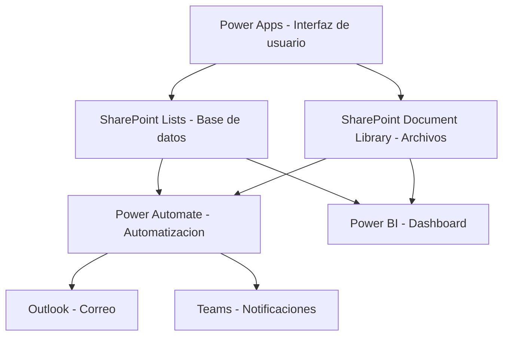
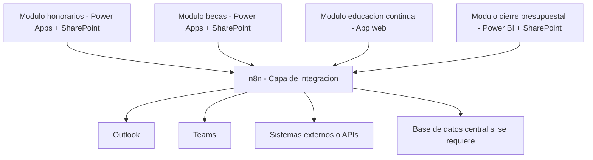
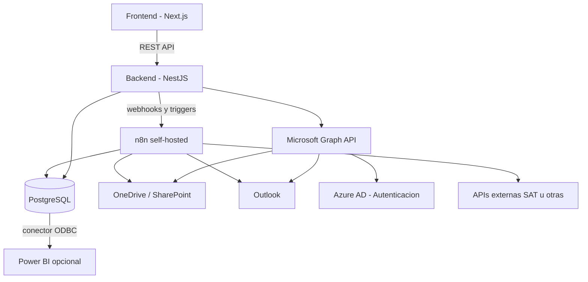
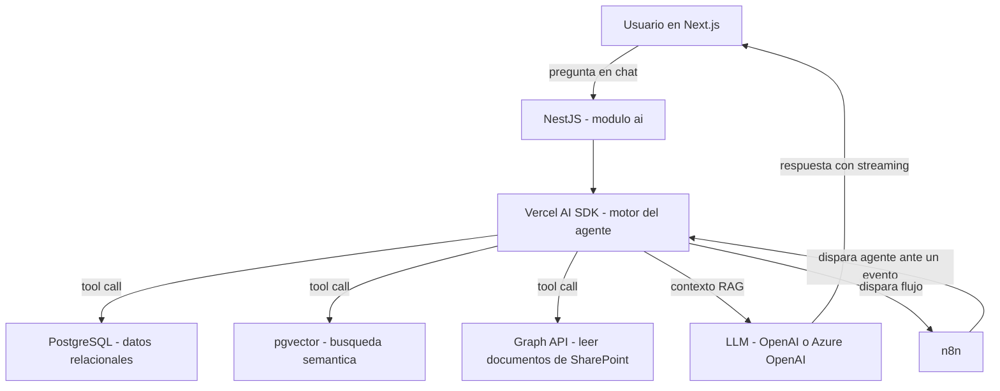

analisis: puedo construir este sistema completamente dentro de microsoft 365

### contexto del analisis

Los datos y documentos ya viven en el entorno Microsoft: correo en Outlook, archivos en OneDrive, tablas en Excel, contratos en Word. El sistema que se quiere construir es solo un módulo de algo más grande, por lo que la arquitectura debe ser modular y escalable. La pregunta es si Microsoft 365 puede resolver esto de forma completa, sencilla y escalable, o si conviene salir del ecosistema y usar herramientas como n8n o un sistema hecho a medida.

---

### respuesta directa

Sí, Microsoft 365 puede resolver este módulo de forma completa. Es factible, tiene sentido técnico y tiene la ventaja de que los datos ya están ahí. Pero tiene limitaciones claras cuando el sistema empiece a crecer hacia otros módulos o hacia lógica más compleja.

La decisión no es blanco o negro. La respuesta más honesta es esta: empieza con Microsoft 365 para este módulo, y diseña desde el inicio con una arquitectura que te permita salir o integrar herramientas externas después sin tener que rehacer todo.

---

### que herramientas de microsoft 365 necesitarias

#### SharePoint Lists o Microsoft Lists

Es la base de datos del sistema dentro del ecosistema Microsoft.

Sirve para:

- registrar proyectos
- registrar participantes con sus estados
- registrar contratos con folios, fechas, observaciones y responsables
- registrar documentos requeridos y cuáles han llegado
- registrar pagos, facturas y complementos

Cada lista es una tabla con filas y columnas. Se puede compartir por permisos, se puede filtrar y sirve como fuente de datos para Power Apps, Power Automate y Power BI.

#### SharePoint Document Library

Es el repositorio de documentos controlado.

Sirve para:

- resguardar contratos, facturas, evidencias, complementos de pago
- organizar carpetas por proyecto o participante
- controlar versiones de documentos
- establecer permisos por carpeta o archivo
- mantener metadatos del documento como estado, tipo y fecha

A diferencia de una carpeta de OneDrive sin estructura, SharePoint permite establecer reglas, flujos y permisos sobre los archivos.

#### Power Apps

Es la interfaz de usuario del sistema.

Sirve para:

- construir formularios de captura estructurados
- registrar nuevos proyectos y participantes
- actualizar estados de contratos
- subir documentos con metadatos
- ver el estado de un expediente de forma ordenada
- tener vistas por proyecto, por responsable, por estado

Power Apps se conecta directamente con SharePoint Lists, por lo que no necesitas desarrollar backend propio. La interfaz puede correr en navegador o en móvil.

#### Power Automate

Es el motor de automatización del sistema.

Sirve para:

- enviar notificaciones cuando un documento llega
- enviar recordatorios cuando pasan 24, 48 o 72 horas sin movimiento
- cambiar estados automáticamente según condiciones
- crear un registro en SharePoint cada vez que llega un correo con folio reconocido en Outlook
- enviar correos estructurados con plantilla cuando se solicita un contrato
- escalar casos vencidos al responsable o al director
- mover documentos a carpetas correctas automáticamente

Power Automate puede leer correos de Outlook, crear registros en listas, mover archivos en SharePoint y enviar avisos por correo o por Teams.

#### Power BI

Es el dashboard de seguimiento.

Sirve para:

- ver cuántos proyectos están activos
- ver cuántos contratos están atorados o sin respuesta
- ver qué documentos faltan por participante
- comparar presupuesto estimado vs ejercido por proyecto
- filtrar por estado, responsable o periodo

Power BI se conecta directamente con SharePoint Lists y puede actualizarse de forma automática o manual.

#### Outlook

Se mantiene como canal de comunicación, pero integrado al flujo.

Con Power Automate conectado a Outlook se puede:

- detectar correos con folio en el asunto
- registrar la llegada de respuestas
- actualizar el estado del caso automáticamente
- enviar confirmaciones o recordatorios al momento correcto

#### Teams

Opcional, pero útil para notificaciones internas.

Sirve para:

- recibir alertas de casos atorados
- tener un canal por módulo o proyecto
- reemplazar parte de la comunicación que hoy va por correo interno

---

### diagrama de arquitectura dentro de microsoft 365



---

### es escalable hacia otros modulos

Sí, pero con matices importantes.

Cada módulo puede ser una app separada en Power Apps que comparte las mismas fuentes de datos en SharePoint. Puedes tener:

- módulo de honorarios
- módulo de becas
- módulo de educación continua
- módulo de cierre presupuestal

Todos conectados a las mismas listas y al mismo repositorio documental, con dashboards compartidos en Power BI.

El problema de escalabilidad aparece cuando los flujos de Power Automate se vuelven muy complejos, cuando necesitas lógica de negocio muy específica que Power Apps no puede manejar bien, o cuando el número de registros o usuarios crece mucho.

---

### limitaciones reales de microsoft 365 para este sistema

#### licencias

No todas las funciones de Power Apps, Power Automate y Power BI están incluidas en todos los planes de Microsoft 365. Algunas automatizaciones avanzadas, conectores premium y capacidades de Power BI Pro tienen costo adicional.

(esto hay que verlo, porque supongo que las cuentas de la escuela no tienen todas las funcionalidades)

#### logica compleja

Power Automate es muy bueno para flujos lineales y condicionales simples. Si el proceso empieza a tener reglas muy específicas, excepciones, cálculos complejos o integraciones con sistemas externos que no son de Microsoft, se vuelve difícil de mantener.

(lo malo y por lo que estba pensando usar n8n, en vez de powerautomate es que tiene sus limitaciones y esto nos puede traer problemas en el futuro ya que es un sistema complejo el cual tenemos muchas automatizacion complejas)

#### interfaz de usuario

Power Apps permite hacer interfaces funcionales, pero tiene limitaciones de diseño y de experiencia de usuario comparado con una app web hecha a medida. Para usuarios que van a usar el sistema todo el día, puede volverse incómodo.

(yo creo que es mejor hacerlo desde cero con codigo ya que, por lo que sé es low code por lo que tiene sus limitaciones y yo creo que es mejor )

#### dependencia de microsoft

Todo queda dentro del ecosistema. Si en algún momento necesitas conectar con un sistema externo, un portal de gobierno, una API pública o una herramienta que no es de Microsoft, la integración puede complicarse.


---

### cuando conviene quedarse en microsoft 365

- cuando los datos ya están ahí y no conviene moverlos
- cuando los usuarios ya usan Outlook, Teams y OneDrive
- cuando el equipo técnico no tiene experiencia en desarrollo web
- cuando se necesita algo funcional rápido sin construir infraestructura propia
- cuando el presupuesto es limitado y ya tienen licencias de Microsoft 365

---

### cuando conviene salir del ecosistema

- cuando los flujos se vuelven tan complejos que Power Automate ya no los soporta bien [✔]
- cuando necesitas una interfaz mucho más personalizada [✔]
- cuando quieres integrar muchos sistemas externos o APIs de terceros
- cuando el sistema va a crecer mucho en usuarios o en volumen de datos 
- cuando quieres tener control total del código y del comportamiento del sistema [✔]

esto hay que tenerlo en cuenta porque es un sistema que se tiene que hacer a la medida para la escuela ya que es un sistema que si sale bien sera usado por todas las facultades de la uady por lo que hay que tener en cuenta que las interfaces, probablemente haya alguna facultad que no tenga el sistema de 365 igual que nosotros por lo que hacerlo todo en un sistema de 365 partiendo de la base de que todas las facultades que la vayan a usar, tienen el mismo ecosistema de microsoft no es verdad, tambien tenemos flujos que son complejos de analizar por lo que hay que tener cuidado con el diseño de la manipulacion de los datos.
---

### que es n8n y cuando tiene sentido usarlo

n8n es una herramienta de automatización de flujos de trabajo de código abierto. Funciona de manera similar a Power Automate pero con ventajas importantes:

- se puede instalar en tu propio servidor, sin depender de un proveedor (esto a mi parecer puede ser muy interesnate no depender de un distribuidor)
- tiene conectores para cientos de sistemas: Gmail, Outlook, Google Sheets, Notion, Airtable, bases de datos, APIs externas y más
- permite lógica más compleja que Power Automate
- es gratuito si lo instalas tú mismo
- es más flexible para integraciones entre ecosistemas distintos

n8n tiene sentido en este proyecto cuando:

- quieras integrar Microsoft 365 con herramientas externas sin pagar conectores premium (esto puede ser interesante, porque estaba pensando integrarlo con google sheet)
- quieras automatizar flujos que Power Automate no soporta bien  ()
- quieras tener control total de los flujos sin depender de licencias
- el sistema empiece a crecer hacia módulos que usen tecnologías distintas

n8n no reemplaza la interfaz de usuario ni la base de datos. Sería la capa de automatización e integración entre piezas del sistema.

---

### que es un sistema hecho a medida y cuando tiene sentido

Un sistema hecho a medida es una aplicación web desarrollada específicamente para este proceso. Puede construirse con tecnologías como:

- backend: Node.js, Django, Laravel, ASP.NET
- frontend: React, Vue, Angular
- base de datos: PostgreSQL, MySQL, SQL Server
- almacenamiento de archivos: Azure Blob Storage, OneDrive API, S3
- autenticación: Microsoft Entra ID para mantener las cuentas institucionales

Ventajas:

- se adapta exactamente al proceso real
- no depende de licencias de terceros
- se puede diseñar modular desde el inicio
- escala bien con más usuarios y más módulos
- la interfaz puede ser exactamente lo que los usuarios necesitan

Desventajas:

- requiere desarrollo inicial más largo
- requiere mantenimiento técnico
- requiere decisiones de arquitectura que si se hacen mal, cuestan caro

Tiene sentido cuando el sistema va a crecer a más de tres o cuatro módulos complejos, cuando hay equipo técnico disponible o cuando Power Apps ya no alcanza para lo que se necesita.

---

### tabla comparativa

| criterio | microsoft 365 | n8n | sistema a medida |
|---|---|---|---|
| velocidad de implementación | alta | media | baja |
| curva de aprendizaje | baja | media | alta |
| costo inicial | bajo si ya tienen licencias | bajo | alto |
| escalabilidad | media | alta | alta |
| flexibilidad de lógica | media | alta | muy alta |
| integración con otros sistemas | limitada | muy alta | muy alta |
| control del código | ninguno | total | total |
| dependencia de proveedor | alta | ninguna | ninguna |
| interfaz de usuario | funcional pero limitada | no aplica | totalmente personalizable |
| mantenimiento | bajo | medio | alto |

---

### recomendacion para tu caso especifico

Dado que los datos ya están en Microsoft, el equipo ya usa Outlook y OneDrive, y este es solo el primer módulo de algo más grande, la recomendación más realista es esta:

**fase 1. construir este módulo dentro de Microsoft 365**

- SharePoint Lists para registrar proyectos, contratos, participantes y estados
- SharePoint Document Library para resguardar archivos
- Power Apps para la interfaz de captura y seguimiento
- Power Automate para automatizar notificaciones, recordatorios y cambios de estado
- Power BI para el dashboard

Esto te da algo funcional rápido, sin costos adicionales si ya tienen las licencias, y sin obligar a nadie a aprender herramientas nuevas.

**fase 2. introducir n8n como capa de integración**

Cuando el sistema empiece a crecer hacia otros módulos o necesites conectar con sistemas externos, n8n puede entrar como la capa de automatización e integración entre piezas del sistema sin reemplazar lo que ya está en Microsoft.

**fase 3. evaluar si algún módulo necesita sistema a medida**

Si algún módulo se vuelve muy complejo para Power Apps, ese módulo específico puede construirse como una app web independiente que se integra vía API con el resto del sistema.

---

### arquitectura modular recomendada



---

### conclusion

Microsoft 365 es una opción válida, factible y suficiente para empezar. No necesitas salirte del ecosistema ahora. Lo que sí debes hacer desde el inicio es diseñar el sistema pensando en módulos independientes y en que eventualmente vas a necesitar integrar piezas fuera de Microsoft.

n8n es el complemento natural cuando llegue ese momento. Un sistema hecho a medida tiene sentido solo si el módulo en cuestión es demasiado complejo para Power Apps o si el sistema total ya tiene un tamaño que justifica el desarrollo propio.

---

## stack tecnico recomendado para alguien con experiencia tecnica

### por que salir de microsoft 365 como base del sistema

Antes de entrar al stack, hay que establecer por qué la decisión ya está tomada. Con base en las notas del análisis anterior, ya tienes tres razones de peso que apuntan a salir de Power Apps como núcleo:

1. Los flujos de automatización son demasiado complejos para Power Automate de forma sostenible.
2. La interfaz necesita ser custom y controlada. Power Apps es low-code y tiene límites reales de diseño y comportamiento.
3. El sistema va a ser usado eventualmente por varias facultades de la UADY, y no todas tienen el mismo nivel de licenciamiento de Microsoft 365. No puedes asumir que el ecosistema es uniforme en toda la institución.

Lo que sí conservas de Microsoft es lo que ya funciona bien: los archivos en OneDrive y SharePoint, las cuentas institucionales en Azure AD y el correo en Outlook. Esas piezas no las mueves. Las consumes desde tu propio sistema vía API.

---

### vision general del enfoque hibrido

La idea es construir un sistema propio que se integra con Microsoft donde ya están los datos, en vez de construir el sistema dentro de Microsoft.



---

### capa de frontend

**Tecnología: Next.js con TypeScript**

Next.js es un framework sobre React que permite hacer aplicaciones web modernas con renderizado del lado del servidor, rutas dinámicas y una arquitectura de componentes bien estructurada.

Por qué es la elección correcta para este sistema:

- React es el ecosistema más maduro para aplicaciones de negocio complejas
- TypeScript te da tipado estático desde el inicio, lo cual es crítico cuando el sistema crezca a varios módulos con muchas entidades y flujos
- Next.js permite separar módulos por rutas y carpetas de forma natural, lo que encaja directo con la arquitectura modular del sistema
- Se puede desplegar en cualquier servidor, no depende de ningún proveedor
- El ecosistema de librerías es enorme

**Librería de componentes: shadcn/ui con Tailwind CSS**

shadcn/ui no es una librería de componentes tradicional. Es un conjunto de componentes copiables, construidos sobre Radix UI primitivos, que viven dentro de tu propio proyecto. Puedes modificar cualquier componente a nivel de código sin depender de versiones externas.

Por qué encaja aquí:

- Full control sobre el diseño sin las limitaciones de Power Apps
- Accesibilidad lista de fábrica con Radix
- Tailwind CSS permite ajustar cualquier detalle visual rápido
- Los componentes que necesitas ya existen: tablas con filtros, formularios multi-paso, drawers, badges de estado, timelines de seguimiento, etc.

**Gestión de estado y datos: TanStack Query**

Para manejar el estado del servidor, peticiones, caché, invalidaciones y loading states de forma limpia sin escribir todo a mano.

---

### capa de backend

**Tecnología: NestJS con TypeScript**

NestJS es un framework de Node.js que sigue una arquitectura modular e inspirada en Angular. Tiene inyección de dependencias, decoradores, separación clara por módulos, controladores y servicios.

Por qué NestJS y no Express o Fastify directamente:

- La arquitectura de módulos de NestJS mapea directamente con la arquitectura modular del sistema. El módulo de honorarios, el de becas, el de cierre presupuestal, cada uno es un módulo de NestJS con su propio controlador, servicio y repositorio.
- Escala bien sin volverse un monolito desordenado
- Si en el futuro necesitas extraer un módulo como microservicio independiente, NestJS facilita esa transición
- TypeScript de punta a punta, misma base que el frontend
- Tiene soporte nativo para integrar con Prisma, TypeORM, autenticación OAuth2, guards, middleware y mucho más

Estructura de módulos que tendría el backend:

```
src/
  modules/
    proyectos/
    participantes/
    contratos/
    documentos/
    becas/
    pagos/
    presupuesto/
  common/
    auth/
    microsoft-graph/
    storage/
    notifications/
```

Cada módulo del negocio es independiente. Comparten la capa de infraestructura común para auth, Graph API y almacenamiento.

---

### capa de base de datos

**Tecnología: PostgreSQL**

Por qué PostgreSQL sobre MySQL o SQL Server:

- Es open source, sin costos de licencia
- Es la base de datos relacional más completa: soporte para JSON columns, full-text search, window functions, CTEs y transacciones ACID robustas
- Maneja bien volúmenes medios y grandes sin necesidad de cambiar de tecnología
- Tiene el mejor soporte en el ecosistema Node.js con ORMs modernos
- Se puede hospedar en Azure, AWS, un VPS propio o local

**ORM: Prisma**

Prisma es el ORM más moderno para Node.js con TypeScript. El esquema de base de datos se define en un archivo `.prisma` con tipado automático generado para todo el proyecto.

Por qué Prisma:

- El esquema actúa como fuente de verdad de la estructura de datos
- Genera tipos TypeScript automáticamente a partir del esquema, lo que elimina errores de tipado entre base de datos y código
- Las migraciones son explícitas y controladas
- El cliente es completamente tipado: si cambias el esquema, el compilador te dice exactamente qué rompe

Tablas principales que tendría la base de datos para el módulo de honorarios:

```
proyectos
participantes
tipos_documento
documentos_requeridos
documentos_entregados
contratos
observaciones_contrato
eventos_contrato
facturas
pagos
complementos_pago
evidencias
cierre_presupuestal
rubros_presupuesto
```

---

### integracion con microsoft sin depender de microsoft

**Microsoft Graph API**

Graph API es la API unificada de Microsoft 365. Con ella puedes hacer todo lo que hace Power Automate y Power Apps respecto a OneDrive, SharePoint y Outlook, pero desde tu propio backend con código que controlas tú.

Lo que usarías de Graph API en este sistema:

- Leer y escribir archivos en OneDrive y SharePoint. Los documentos siguen viviendo donde ya están.
- Leer correos de Outlook con folios reconocidos para actualizar estados automáticamente
- Enviar correos desde las cuentas institucionales
- Autenticar usuarios con sus cuentas universitarias de Azure AD sin que tengan que crear otra cuenta

**Autenticación: Microsoft Entra ID con OAuth2 y OIDC**

Los usuarios se autentican con su cuenta institucional de Microsoft. El backend valida el token con la librería MSAL. No hay gestión de contraseñas propias.

Esto es importante para la escalabilidad entre facultades: cada usuario entra con su cuenta universitaria existente. No necesitas una cuenta nueva por facultad.

---

### capa de automatizacion

**Tecnología: n8n self-hosted**

n8n reemplaza completamente a Power Automate y tiene un nivel de control y flexibilidad muy superior.

Por qué n8n y no quedarse con Power Automate:

- Se instala en tu propio servidor con Docker en un solo comando
- No depende de licencias de Microsoft ni de su plan de automatización
- Tiene más de 400 integraciones nativas incluyendo Outlook, OneDrive, SharePoint, PostgreSQL, HTTP, SAT, y lo que necesites
- Permite lógica condicional compleja, loops, manejo de errores, reintentos y subflows
- Los flujos se pueden versionar y exportar como JSON
- Puedes programar nodos personalizados en JavaScript si necesitas algo que no tiene nativo

Flujos que manejaría n8n en este sistema:

- Escuchar correos de Outlook con folio en el asunto y actualizar el estado del contrato en PostgreSQL
- Enviar recordatorio automático cuando un contrato lleva más de 48 horas sin movimiento
- Notificar al director cuando un caso supera cierto número de días sin respuesta
- Detectar cuando llega un complemento de pago y cambiar el estado del expediente
- Validar que los documentos subidos tengan el nombre con el formato correcto
- Generar un reporte semanal de contratos atorados y enviarlo por correo
- Integrarse con el SAT o portales externos si se requiere en el futuro

La comunicación entre tu backend y n8n es por webhooks. Tu backend dispara un evento, n8n lo recibe y ejecuta el flujo correspondiente.

---

### almacenamiento de archivos

Los archivos no se mueven. Siguen en OneDrive y SharePoint porque ya están ahí y los usuarios ya los manejan desde ahí.

Lo que cambias es la capa de control:

- Tu backend sube y organiza archivos en SharePoint vía Graph API
- Tu backend guarda en PostgreSQL los metadatos del archivo: ruta, tipo, versión, estado, fecha, usuario, observaciones
- El sistema muestra los archivos y su estado desde tu interfaz, no desde el explorador de SharePoint
- Las versiones y observaciones se controlan desde tu base de datos, no desde carpetas sueltas

---

### dashboard y reportes

Para dashboards dentro de la aplicación puedes usar Recharts o Chart.js directamente en Next.js. Eso te da dashboards en tiempo real conectados a tu API.

Para reportes analíticos más complejos entre módulos y periodos, Power BI sigue siendo válido. PostgreSQL tiene un conector ODBC estándar. Power BI puede conectarse directamente a tu base de datos sin depender de SharePoint Lists. Si una facultad no tiene Power BI, puedes ofrecer Metabase como alternativa open source que también se conecta a PostgreSQL.

---

### infraestructura

**Docker y docker-compose**

Todo el sistema se conteneriza: Next.js, NestJS, PostgreSQL y n8n. Esto te da:

- Portabilidad total. Corre igual en Azure, en un VPS de la UADY o en cualquier servidor
- Entorno local idéntico al de producción
- Despliegue reproducible sin dependencias manuales

**Hospedaje recomendado: Azure**

Aunque el sistema ya no depende de Microsoft 365, Azure tiene sentido para hospedaje porque:

- Menor latencia para las llamadas a Graph API
- Integración nativa con Azure AD
- La institución probablemente ya tiene convenio con Microsoft

Si no es posible Azure, cualquier VPS con Ubuntu y Docker sirve igual.

---

### por que este stack encaja con la modularizacion del sistema

Uno de los puntos más importantes es que este es solo el primer módulo. El stack propuesto escala a múltiples módulos de forma natural.

Cada módulo nuevo que agregues al sistema sigue la misma estructura:

- Módulo de NestJS en el backend con sus propias rutas, servicios y repositorios
- Sección de rutas en Next.js con sus propias páginas y componentes
- Tablas propias en PostgreSQL pero en la misma base de datos compartida
- Flujos propios en n8n

Todos los módulos comparten:

- La misma autenticación con Azure AD
- La misma integración con Graph API para archivos y correo
- El mismo sistema de notificaciones
- Los mismos dashboards de Power BI o Metabase
- La misma base de datos PostgreSQL como fuente de verdad

Esto es lo que hace que el sistema sea escalable a otras facultades: no depende de que cada facultad tenga el mismo plan de Microsoft 365. Solo necesitan un navegador y sus cuentas institucionales de Azure AD.

---

### tabla resumen del stack

| capa | tecnologia | por que |
|---|---|---|
| frontend | Next.js + TypeScript | modular, SSR, control total |
| componentes UI | shadcn/ui + Tailwind CSS | custom, accesible, sin limitaciones de low-code |
| estado del servidor | TanStack Query | caché, loading states, invalidaciones |
| backend | NestJS + TypeScript | arquitectura modular, escala limpio |
| base de datos | PostgreSQL | open source, robusto, SQL real |
| ORM | Prisma | tipado generado, migraciones controladas |
| autenticacion | Microsoft Entra ID + MSAL | cuentas institucionales, SSO |
| archivos | Graph API + SharePoint/OneDrive | archivos donde ya están |
| automatizacion | n8n self-hosted | flujos complejos, sin licencias, control total |
| email | Graph API + Outlook | integrado con el correo institucional |
| dashboard interno | Recharts o Chart.js | en tiempo real dentro de la app |
| reportes avanzados | Power BI o Metabase | conectado a PostgreSQL vía ODBC |
| infraestructura | Docker + docker-compose | portabilidad, reproducibilidad |
| hospedaje | Azure o VPS con Ubuntu | Azure por proximidad a Graph API |

---

### resumen del por que este enfoque

Power Apps te limita en diseño, lógica y costo de licencias. Power Automate te limita en flujos complejos y en integraciones externas. SharePoint Lists no es una base de datos relacional real y no te da las consultas ni la consistencia que este sistema va a necesitar.

Con el stack propuesto tienes control total del código, una base de datos real, automatización sin límites de licencia, y la capacidad de integrarte con cualquier sistema externo. Conservas lo que ya funciona en Microsoft: los archivos, el correo y la autenticación. Y construyes encima de eso con herramientas que no te van a limitar cuando el sistema crezca.

---

## compatibilidad del stack con un agente de ia

### respuesta directa

El stack recomendado no solo es compatible con un agente de IA, sino que está construido exactamente sobre las piezas que un agente necesita para funcionar bien. No hay que cambiar nada del stack existente. Se agregan extensiones encima de lo que ya está.

Las razones son tres:

1. PostgreSQL puede convertirse en base de datos vectorial con una extensión. Eso habilita búsqueda semántica sobre documentos, contratos, observaciones y cualquier texto del sistema.
2. NestJS puede alojar el motor del agente como un módulo más. El agente tiene acceso a todos los datos del sistema porque vive en el mismo backend.
3. n8n ya tiene nodos nativos de LLM y agentes. Puede ejecutar flujos disparados por el agente o disparar al agente como parte de un flujo.

---

### que podria hacer el agente en este sistema

Pensando en los problemas concretos que describió el cliente, el agente podría resolver estos casos de uso:

**busqueda de informacion dentro del sistema**

- ¿En qué estado está el contrato de Luis García del proyecto Ayuntamiento?
- ¿Qué documentos le faltan a los participantes del proyecto X?
- ¿Cuántos contratos llevan más de 30 días sin respuesta?
- ¿Quién fue la última persona que respondió en el hilo del contrato 2026-014?

**apoyo operativo**

- Redactar el borrador del correo de solicitud de contrato con base en los datos del participante ya registrado
- Resumir las observaciones acumuladas en el historial de un contrato
- Generar un listado de pendientes por responsable para la semana
- Detectar inconsistencias en documentos, por ejemplo si el nombre de un archivo no sigue el formato definido

**busqueda sobre documentos reales**

Con RAG el agente puede leer los documentos almacenados en SharePoint y responder preguntas sobre su contenido sin que el usuario tenga que abrirlos. Por ejemplo: ¿qué actividades describe la cotización de Carlos Mendoza?, ¿qué dice el contrato 2026-009 respecto al periodo de pago?

**apoyo a la trazabilidad**

- ¿Qué pasó con el expediente del proyecto becas FMAT 2025 desde que se solicitó el contrato?
- Dame un resumen de todo lo que ha ocurrido con el participante X desde que entró al sistema.

---

### que hay que agregar al stack

El stack no cambia. Se agregan tres piezas:

#### 1. pgvector en PostgreSQL

pgvector es una extensión oficial de PostgreSQL que agrega un tipo de columna `vector` y operadores de similitud coseno y distancia euclidiana. Con eso PostgreSQL puede funcionar como base de datos vectorial sin necesidad de instalar Pinecone, Weaviate ni ningún servicio externo.

Lo que se vectoriza:

- contenido de documentos de SharePoint procesados y fragmentados
- texto de observaciones y eventos de contratos
- resúmenes de expedientes de participantes
- correos procesados que ya están registrados en el sistema

Cada fragmento se guarda con su vector de embedding junto a su referencia al registro original en la base de datos. Así el agente puede encontrar fragmentos relevantes y luego ir a buscar el dato exacto en las tablas relacionales.

Esto no requiere migrar ni cambiar nada del schema existente. Se agregan tablas nuevas de embeddings que referencia a los registros ya existentes.

#### 2. Vercel AI SDK en NestJS

Vercel AI SDK es la librería más madura del ecosistema Node.js/TypeScript para construir agentes y flujos de IA. Tiene soporte para OpenAI, Azure OpenAI, Anthropic, Google y modelos locales con Ollama.

Lo que permite hacer dentro de NestJS:

- definir tools tipadas en TypeScript que el agente puede llamar
- manejar streaming de respuestas hacia el frontend
- construir flujos de razonamiento multi-paso
- hacer RAG: recuperar fragmentos relevantes de pgvector y pasarlos como contexto al LLM
- encadenar llamadas al agente con acciones reales sobre la base de datos

Un tool del agente para este sistema podría verse así conceptualmente:

```
tool: buscar_documentos_faltantes
  parametros: proyecto_id
  accion: consulta a PostgreSQL los documentos requeridos vs entregados
  retorna: lista estructurada de faltantes por participante

tool: obtener_historial_contrato
  parametros: contrato_folio
  accion: consulta la tabla de eventos del contrato ordenada por fecha
  retorna: timeline completo del contrato

tool: buscar_en_documentos
  parametros: pregunta en lenguaje natural
  accion: genera embedding de la pregunta, busca en pgvector, retorna fragmentos relevantes
  retorna: fragmentos de documentos con referencia al original
```

El agente decide qué tools usar según la pregunta del usuario. El LLM razona, llama las tools en el orden necesario, y construye la respuesta final con datos reales del sistema.

#### 3. interfaz de chat en Next.js

Un componente de chat que se integra en la interfaz del sistema. No es una pantalla aparte, sino un panel lateral o flotante disponible desde cualquier módulo.

Vercel AI SDK exporta hooks de React que manejan el streaming, el estado del chat y el historial de mensajes de forma nativa. El componente de chat usa shadcn/ui, que ya está en el stack, así que el diseño es consistente con el resto del sistema.

---

### donde vive el agente dentro de la arquitectura



El agente vive como un módulo de NestJS llamado `ai`. Tiene acceso a todos los demás módulos del sistema porque es parte del mismo backend. Cuando necesita datos, no llama a una API externa, llama directamente a los servicios internos.

---

### que proveedor de LLM usar

Hay dos opciones que encajan bien con este contexto:

**Azure OpenAI**

Si la institución ya tiene acuerdo con Microsoft, Azure OpenAI es la opción más natural. Los modelos de OpenAI corren dentro de la infraestructura de Azure, los datos no salen al exterior y se puede integrar con el mismo Azure AD que ya se usa para la autenticación. Vercel AI SDK tiene soporte nativo para Azure OpenAI.

**Ollama con modelos locales**

Si no hay presupuesto para Azure OpenAI o si se requiere que los datos no salgan de la infraestructura propia, Ollama permite correr modelos como Llama 3, Mistral o Qwen en un servidor local. Se conteneriza con Docker igual que el resto del sistema. El rendimiento depende del hardware disponible, pero para búsqueda semántica y preguntas sobre documentos estructurados es perfectamente viable.

La arquitectura permite cambiar de proveedor sin tocar el resto del código porque Vercel AI SDK abstrae el LLM con una interfaz uniforme.

---

### actualizacion de la tabla resumen del stack

| capa | tecnologia | por que |
|---|---|---|
| frontend | Next.js + TypeScript | modular, SSR, control total |
| componentes UI | shadcn/ui + Tailwind CSS | custom, accesible, sin limitaciones de low-code |
| estado del servidor | TanStack Query | caché, loading states, invalidaciones |
| backend | NestJS + TypeScript | arquitectura modular, escala limpio |
| base de datos | PostgreSQL + pgvector | relacional y vectorial en un solo motor |
| ORM | Prisma | tipado generado, migraciones controladas |
| autenticacion | Microsoft Entra ID + MSAL | cuentas institucionales, SSO |
| archivos | Graph API + SharePoint/OneDrive | archivos donde ya están |
| automatizacion | n8n self-hosted | flujos complejos, sin licencias, control total |
| email | Graph API + Outlook | integrado con el correo institucional |
| agente de ia | Vercel AI SDK + NestJS | tools tipadas, RAG, streaming, multi-step |
| LLM | Azure OpenAI u Ollama | según presupuesto e infra disponible |
| busqueda semantica | pgvector | embebido en PostgreSQL, sin servicio externo |
| dashboard interno | Recharts o Chart.js | en tiempo real dentro de la app |
| reportes avanzados | Power BI o Metabase | conectado a PostgreSQL vía ODBC |
| infraestructura | Docker + docker-compose | portabilidad, reproducibilidad |
| hospedaje | Azure o VPS con Ubuntu | Azure por proximidad a Graph API y OpenAI |

---

### conclusion sobre ia en este stack

No necesitas cambiar el stack. Necesitas extenderlo. pgvector convierte tu PostgreSQL existente en una base de datos vectorial. Vercel AI SDK da al agente acceso directo a todos los datos y servicios del sistema porque vive dentro de NestJS. n8n puede disparar al agente o ser disparado por él.

El resultado es un agente que no trabaja sobre datos externos ni genéricos, sino sobre los datos reales de tu sistema: contratos, participantes, documentos, estados, historial, correos. Eso es exactamente lo que hace que un agente sea útil en un sistema de gestión operativa.