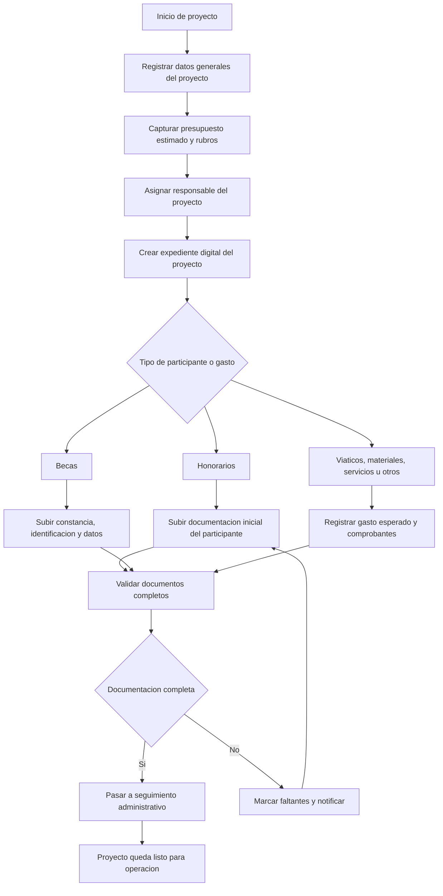
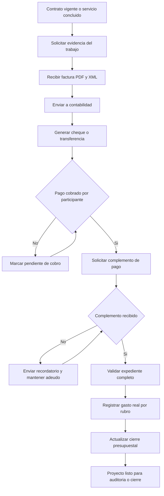
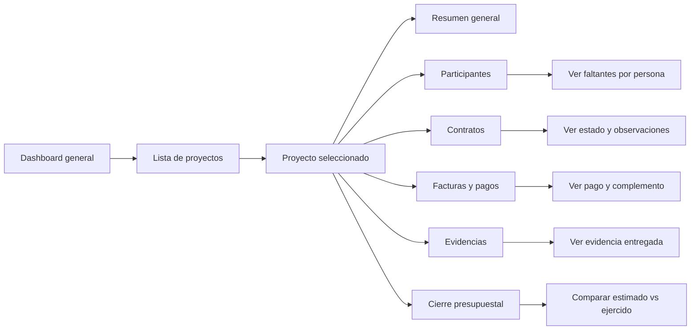

# Diseño inicial

## resumen de la platica

La plática se centra en el proceso administrativo y documental que sigue la facultad para gestionar proyectos, principalmente en los rubros de honorarios y becas, y en menor medida viáticos, servicios, materiales y otros gastos.

En honorarios, el proceso inicia cuando se reúne la documentación de la persona que prestará el servicio. Con esa información se solicita el contrato por correo electrónico a otra área. A partir de ahí comienza un intercambio largo de correos, documentos de Word con observaciones, aclaraciones, documentos faltantes y nuevas versiones del mismo contrato. Ese seguimiento actualmente se hace de forma manual, apoyándose en correos, archivos de Excel y carpetas en OneDrive.

Además del contrato, durante la ejecución y cierre del proyecto también se deben reunir otros documentos: facturas, evidencias del trabajo realizado, comprobantes de pago y complementos de pago. Todo esto es necesario para justificar el gasto, cumplir con contabilidad, responder a auditorías y poder cerrar correctamente el proyecto.

En becas, el proceso es más simple. Se recopila la documentación del estudiante, se genera un oficio o documento para contabilidad y se tramita el pago correspondiente durante el periodo definido.

También se mencionan otros gastos del proyecto, como viáticos, materiales o servicios, que requieren facturas o comprobantes. Esa información luego debe servir para el cierre presupuestal del proyecto, comparando lo estimado contra lo realmente gastado.

El problema general es que toda la operación depende de correos, documentos sueltos, múltiples versiones, archivos manuales de control y carpetas en OneDrive que no siempre están completas o actualizadas. Esto provoca retrasos, pérdida de seguimiento, dificultad para saber en qué estado está cada contrato o proyecto, y riesgos frente a auditoría.

## que es lo que quiere en el sistema segun la platica 

El cliente quiere un sistema para organizar y dar seguimiento a toda la documentación administrativa de los proyectos, especialmente la relacionada con honorarios. No está pidiendo un sistema financiero completo, sino una herramienta que le permita controlar procesos, documentos, estados y pendientes.

Quiere un sistema que le ayude a:

- registrar proyectos y mantener su expediente documental
- organizar la documentación de participantes, contratos, facturas, evidencias y complementos de pago
- dar seguimiento al proceso de contratos desde la solicitud hasta la firma y resguardo final
- saber en qué estado va cada contrato, qué observaciones tiene, quién respondió y qué falta por entregar
- evitar perder versiones de documentos y reducir el caos del intercambio por correo electrónico
- concentrar en un solo lugar la trazabilidad de correos, observaciones, archivos y respuestas
- controlar pagos de honorarios y becas junto con la documentación de respaldo
- registrar facturas y comprobantes de otros gastos como viáticos, materiales y servicios
- facilitar el cierre presupuestal del proyecto con base en la documentación real
- tener visibilidad general mediante algo parecido a un dashboard o tablero de seguimiento
- tener un dasbor en el cual pueda ver los proyectos y en que estados estan los proyectos.

## que sistema quiere el cliente

El cliente quiere un sistema de gestión documental y seguimiento administrativo de proyectos.

Ese sistema estaría enfocado en centralizar información y controlar procesos internos. Debe funcionar como un expediente digital por proyecto, donde se pueda consultar de manera ordenada toda la documentación relacionada con:

- datos generales del proyecto
- responsables del proyecto
- participantes por honorarios
- participantes por beca
- contratos y sus versiones
- observaciones hechas por jurídico o vinculación
- facturas, XML y PDF
- evidencias del trabajo realizado
- complementos de pago
- comprobantes y facturas de otros rubros
- cierre presupuestal del proyecto
- pagos a los encargados de proyectos al igual que los invlocrados

Además, el sistema idealmente debe permitir saber el estado actual de cada trámite. Por ejemplo:

- documentación incompleta
- contrato solicitado
- contrato con observaciones
- en espera de respuesta
- contrato finalizado
- pendiente de firma
- pendiente de factura
- pendiente de evidencia
- pendiente de complemento de pago
- listo para cierre
- proyecto cerrado

## que quiere organizar

El cliente quiere organizar cuatro cosas principales:

1. La documentación de cada proyecto.
Quiere que cada proyecto tenga su información y sus archivos completos, ordenados y localizables.
(Notas: aqui lo que se tiene que tener un dashbord en el cual se le avise al usuario el estado de la documentacion del proyecto, para que todos los involucrados esten al tanto )

2. El seguimiento de contratos de honorarios.
Quiere controlar el intercambio de solicitudes, observaciones, correcciones y versiones de contratos sin depender únicamente del correo.


3. El control de pagos y comprobación.
Quiere relacionar contratos, facturas, evidencias, cheques, pagos y complementos para no tener huecos administrativos ni fiscales.

4. El cierre presupuestal.
Quiere poder comparar lo presupuestado contra lo ejecutado con respaldo documental suficiente.

5. evitar mensajeria ineficiente
quiere poder mandar los datos o documentos que hacen falta de manera sencilla sin que tenga que eestar rebotando entre personas diferentes
(Nota: lo que se puede hacer es que desde el principio le avise al usuario que es lo que hace falta, que documento hace falta, es decir avise antes de ser enviado al encarjado de los documentos)

## que problema quiere arreglar

El cliente quiere arreglar principalmente el desorden y la falta de trazabilidad del proceso administrativo.

Los problemas concretos que quiere resolver son:

- exceso de dependencia del correo electrónico para trámites importantes
- dificultad para dar seguimiento al ping pong de observaciones de contratos (importante, todavia por resolver)
- pérdida de tiempo buscando correos, documentos o versiones correctas(tener una buena index en la base de datos, para una buena busqueda de los datos, y tener un buscador de documentos en el sistema)
- múltiples archivos de Word del mismo contrato sin control claro (esto pasa por que lo que hacen es que descargan el archivo y lo suben con los cambios, pero ya en la "base de datos" solo habra una version la caul es la ultima version del archvio el cual es el que vale)
- uso excesivo de controles manuales en Excel (se podria todavia quedar con algunas tablas excel las que sean estrictamente necesarias, pero intentar hacer una interfaz en la cual el usuario agregue los datos de ese excel y se agrege automaticamente, tener un log de los mensajes, para tener un resgistro de lo que se hizo y lo que se dijo en los mensajes)
- carpetas de OneDrive incompletas, desactualizadas o vulnerables a errores humanos (tener un script que generlace el formota, y hacer script para que mapeo los documentos de las carpetas)
- falta de certeza sobre qué documentos tiene cada proyecto y cuáles faltan (tener una dashbord con la informacion de cada proyecto y obviamnete puedas entrar y que te diga que documentos te hacen falta)
- imposibilidad de ver rápidamente el estado general de contratos y proyectos (esto lo resolvemos con un status ademas de los documentos faltantes, los proyectos y contratos tendrian estados)
- retrasos administrativos que incluso continúan cuando el proyecto ya terminó
- riesgos de auditoría por ausencia de evidencias o complementos de pago
- dificultad para cerrar presupuestos con información dispersa

## conclusion del analisis

El cliente no está describiendo solamente un problema de almacenamiento de archivos, sino un problema de control operativo. El dolor principal está en la trazabilidad del proceso: saber qué se pidió, qué llegó, qué se corrigió, qué falta, quién respondió, en qué estado va cada contrato y si el proyecto ya cuenta con toda la documentación necesaria para pago, auditoría y cierre.

Por lo tanto, el sistema que necesita debe ayudarle a centralizar documentos, registrar estados, mantener historial de cambios y permitir consultar el avance de cada proyecto sin depender de búsquedas manuales en correos, Excel y carpetas dispersas.

## diagramas de flujo propuestos para el sistema

### 1. flujo general de entrada de informacion del proyecto



### 2. flujo de seguimiento de contratos de honorarios

```mermaid
flowchart TD
	A[Participante por honorarios registrado] --> B[Reunir documentacion requerida]
	B --> C{Documentacion completa}
	C -- No --> D[Solicitar documentos faltantes]
	D --> B
	C -- Si --> E[Generar solicitud de contrato]
	E --> F[Enviar solicitud a vinculacion o juridico]
	F --> G[Registrar fecha, responsable y numero de control]
	G --> H{Hay observaciones}
	H -- Si --> I[Registrar observaciones]
	I --> J[Subir nueva version o aclaraciones] <!-- siempre tener una sola version no duplicar el estado del contrato -->
	J --> K[Reenviar contrato corregido]
	K --> H
	H -- No --> L[Contrato aprobado]
	L --> M[Firma de partes]
	M --> N[Resguardar contrato final]
	N --> O[Actualizar estado del participante]
```

**Nota: en si en este caso aunque quiere hacerlo lo mas automatico posible, no se puede, porque siempre habrá que enviar la solictud y que un independiente al que mando la solicitud y al sitema mande el doc**

### 3. flujo de pago, evidencia y cierre



### 4. flujo de vista operativa del sistema


**Nota:esta es la vista que el sistema sobre los proyectos, que es muy importante, ya que es la vista de los proyectos**

## como se veria la entrada de informacion en el sistema

La entrada de información debería dividirse en bloques para que no todo se capture de golpe y para que el sistema pueda validar faltantes desde el inicio. Esto nos ayudaria a resolver ciertos problemas desde el princio, como seria el problema de que los involucrados no saben en que estado esta el contrato y que documentos les hace falta.

### bloque 1. datos del proyecto

- nombre del proyecto
- cliente o empresa
- responsable interno
- periodo del proyecto
- monto total
- presupuesto por rubros
- estado general del proyecto
- honorarios

### bloque 2. participantes (esto seria con un interfaz)

Cada participante debería registrarse como una entidad separada dentro del proyecto.

Campos sugeridos:

- nombre completo
- tipo de participante: honorarios o beca
- rol o actividad
- periodo de participación
- monto a pagar
- responsable que valida
- estado documental


**nota: el participante tiene que tener docuemtnos que se le especifican a lo hora de que entra y todo para que pueda tener su contrato**

### bloque 3. documentacion

Cada participante y cada proyecto deberían tener documentos asociados con estado.

Ejemplos:

- identificación
- constancia
- cotización
- contrato
- factura PDF
- factura XML
- evidencia
- complemento de pago
- comprobantes de otros gastos

Cada documento debería tener:

- fecha de carga
- usuario que lo subió
- versión
- estado: pendiente, recibido, validado, rechazado
- observaciones

### bloque 4. seguimiento

El sistema debería registrar eventos del proceso, por ejemplo:

- contrato solicitado
- contrato observado
- respuesta enviada
- factura recibida
- pago emitido
- complemento pendiente
- expediente completo

Esto permitiría construir la trazabilidad sin depender del correo como única fuente de verdad.

## analisis de herramientas para automatizar procesos

### opcion 1. ecosistema microsoft

Es la opción más natural porque el cliente ya trabaja con Outlook, Excel, Word y OneDrive.

Herramientas recomendadas:

- Power Apps para construir la interfaz de captura y seguimiento
- SharePoint Lists o Microsoft Lists para guardar proyectos, participantes, estados y pendientes
- SharePoint Document Library para almacenar documentos con estructura controlada
- Power Automate para automatizar correos, recordatorios, aprobaciones, cambios de estado y generación de tareas
- Outlook para integrarse con correos de solicitud y seguimiento
- Power BI para dashboards de estado, atrasos, pagos pendientes y cierre de proyectos
- Teams para notificaciones internas o aprobaciones rápidas

Ventajas:

- se integra bien con lo que ya usan
- reduce curva de adopción
- permite automatizar sin desarrollar todo desde cero
- facilita permisos, historial y control documental
- puede generar dashboards rápidamente

Desventajas:

- puede volverse complejo si el proceso crece mucho
- algunas automatizaciones avanzadas pueden depender de licencias
- si el diseño se hace mal, puede terminar siendo otro sistema complicado de mantener

### opcion 2. sistema web a medida

Consiste en crear una aplicación propia para proyectos, participantes, contratos, pagos y cierre documental.

Tecnologías posibles:

- frontend: React, Vue o una interfaz web clásica
- backend: Node.js, Django, Laravel o ASP.NET
- base de datos: PostgreSQL o MySQL
- almacenamiento de archivos: OneDrive, SharePoint o almacenamiento propio
- autenticación: Microsoft Entra ID si quieren seguir con cuentas institucionales

Ventajas:

- se adapta exactamente al proceso real del cliente
- permite controlar mejor estados, reglas y trazabilidad
- puede crecer a futuro hacia otros procesos como educación continua
- evita depender demasiado de hojas de Excel dispersas

Desventajas:

- requiere más tiempo de desarrollo
- requiere mantenimiento técnico
- implica diseñar seguridad, permisos, versionado e integración documental

### opcion 3. enfoque hibrido

Es probablemente la mejor opción para iniciar.

Consiste en hacer un sistema principal para control de proyectos y estados, pero mantener parte del ecosistema documental dentro de Microsoft 365.

Ejemplo de combinación:

- sistema web o Power Apps para registrar y consultar información
- SharePoint o OneDrive para resguardar archivos
- Power Automate para disparar avisos y tareas automáticas
- Power BI para dashboard de seguimiento

Ventajas:

- permite avanzar más rápido
- aprovecha herramientas existentes
- reduce el riesgo de construir todo desde cero
- deja abierta la posibilidad de crecer después

## procesos que si conviene automatizar

Los procesos con mayor valor para automatizar, según la plática, son estos:

1. Validación de documentos faltantes.
Cuando se registre un participante, el sistema puede marcar automáticamente qué documentos faltan según su tipo.

2. Seguimiento de contratos.
Cada solicitud puede tener estado, fecha, responsable, última respuesta y contador de observaciones.

3. Recordatorios automáticos.
Enviar correos o alertas cuando falte factura, evidencia, firma o complemento de pago.

4. Control de versiones de documentos.
Evitar múltiples archivos sueltos del mismo contrato y mantener una versión vigente identificable.

5. Dashboard de proyectos.
Mostrar cuántos proyectos están activos, cuántos contratos están atorados, qué pagos faltan y qué expedientes están incompletos.

6. Cierre presupuestal.
Relacionar rubros estimados con comprobantes reales para facilitar el cierre.

notas: hay que tener en cuenta que lo que hay que hacer es usar n8n, para poder automatizar tareaas

## recomendacion tecnica inicial

Si el objetivo es empezar rápido y con menos riesgo, la ruta más realista sería:

1. Microsoft Lists o SharePoint para estructurar proyectos, participantes y estados.
2. SharePoint Document Library para resguardar documentos por proyecto.
3. Power Automate para notificaciones, seguimiento y recordatorios.
4. Power BI para el dashboard.
5. Más adelante, si el proceso madura, migrar a un sistema web más robusto o integrarlo con uno.
6. generalizar los nombres de los documentos, hacer un script que modifique y anlice si el nombre del documento es el correcto, para que sea mas facil de manipular en el sistema

Esta recomendación tiene sentido porque el problema principal no es primero la complejidad técnica, sino ordenar el flujo, centralizar la información y dejar trazabilidad del proceso.	

## como resolver el problema de los mensajes entre dos personas sin salir de gmail

El problema real no es solamente que usen correo, sino que el correo hoy funciona como si fuera una conversación libre y no como un proceso controlado. Si una persona revisa contratos y otra persona los envía, el riesgo aparece cuando no existe una confirmación obligatoria, un estado visible y un seguimiento centralizado.

Si quieren conservar Gmail, la forma más práctica de resolverlo es convertir cada solicitud de contrato o revisión en un caso controlado, con identificador, estado, responsable y confirmación de lectura o atención.

## idea principal

No dejar que el mensaje sea la única fuente de verdad.

El correo puede seguir existiendo, pero debe estar respaldado por un registro central donde quede claro:

- quién envió la solicitud
- a quién le toca revisarla
- cuándo se envió
- si fue leída o no
- si ya tuvo respuesta
- qué documentos faltan
- cuál es el último estado real del contrato

## solucion recomendada manteniendo gmail

### opcion 1. gmail + hoja de control + automatizacion

Esta es la opción más simple para comenzar.

Se puede hacer así:

1. Cada contrato o solicitud recibe un folio único.
Ejemplo: CONTRATO-2026-014.

2. Ese folio debe aparecer siempre en el asunto del correo.
Ejemplo: Solicitud de contrato CONTRATO-2026-014.

3. Cada vez que se envíe un correo, se registra automáticamente en una hoja de control o base de datos simple.

4. La hoja debe tener columnas como estas:

- folio
- proyecto
- participante
- responsable de enviar
- responsable de revisar
- fecha de envío
- última respuesta
- estado actual
- documentos faltantes
- prioridad
- fecha límite de respuesta
- semáforo

5. Un script o automatización revisa periódicamente si hubo respuesta al hilo.

6. Si no hubo respuesta en cierto tiempo, se marca como pendiente y se manda recordatorio.

7. Si alguien responde, el estado cambia y queda registrado.

Con esto, aunque el correo se pierda visualmente en Gmail, el caso sigue existiendo en el tablero de control.

## como evitar que no lean el mensaje o que se pierda

Para evitar eso no basta con enviar el correo. Hay que poner reglas de operación.

### regla 1. todo correo debe tener folio

Si no tiene folio, no entra al flujo formal.

### regla 2. todo correo debe registrarse en un tablero

El tablero debe ser la verdad operativa. El correo solo es el medio de comunicación.

### regla 3. todo caso debe tener estado visible

Ejemplos de estado:

- enviado
- recibido
- en revisión
- con observaciones
- pendiente de documentos
- reenviado
- aprobado
- cerrado
- vencido sin respuesta

### regla 4. debe existir acuse de atención

No necesariamente de lectura técnica, sino de atención operativa.

Por ejemplo, quien revisa debe cambiar el estado a uno de estos:

- recibido y en revisión
- faltan documentos
- revisado con observaciones
- aprobado

Eso vale más que una confirmación de lectura de correo, porque obliga a una acción dentro del proceso.

### regla 5. debe haber alertas por silencio

Si pasan 24, 48 o 72 horas sin cambio de estado, el sistema debe:

- mandar recordatorio
- cambiar el semáforo a amarillo o rojo
- avisar al responsable
- escalar si rebasa cierto tiempo

## herramientas concretas que podrias usar con gmail

### opcion A. Gmail + Google Sheets + Apps Script

Es la mejor opción si quieres algo rápido, barato y dentro del ecosistema de Google.

Con esto podrías hacer:

- registrar folios automáticamente
- leer correos por asunto o etiqueta
- detectar respuestas en hilos
- actualizar una hoja de seguimiento
- mandar recordatorios automáticos
- generar alertas de casos sin respuesta
- crear un pequeño dashboard en Looker Studio o en la misma hoja

Automatizaciones útiles con Apps Script:

- cuando se envía un correo con cierto formato, crear registro automático
- si el correo entra con etiqueta contrato, guardar fecha y asunto
- si pasan 2 días sin respuesta, enviar alert
- si llega respuesta, actualizar última actividad
- si el hilo cambia a aprobado, cerrar caso

### opcion B. Gmail + Google Sheets + AppSheet

Si además quieres una interfaz más tipo sistema, AppSheet puede servir.

Con esto podrías tener:

- formulario de captura de solicitudes
- tablero con estados
- lista de pendientes
- vista por proyecto
- vista por responsable
- filtros por atrasados
- panel móvil para revisar rápidamente

Esto es útil porque ya no dependerías de abrir el correo para saber cómo va cada trámite.

### opcion C. Gmail + Trello o ClickUp

Si no quieres programar tanto al inicio, puedes usar Gmail junto con una herramienta de tareas.

Cada contrato se vuelve una tarjeta o tarea con:

- folio
- responsable
- checklist de documentos
- fecha límite
- comentarios
- archivos adjuntos
- estado

Esto mejora mucho el seguimiento, aunque no resuelve tan bien la automatización documental como una solución con Google Sheets o AppSheet.

## propuesta operativa concreta

idea para poder hacer el sistema

1. Crear un formulario interno de alta de solicitud.
Ahí se captura proyecto, participante, tipo de trámite y documentos esperados.

2. El sistema genera un folio automáticamente.

3. Ese folio se inserta en el asunto del correo de Gmail.

4. Al mandar el correo, se crea o actualiza un registro central.

5. El revisor no responde solo por correo: también actualiza el estado del caso.

6. Si pide documentos faltantes, se registran como faltantes concretos y no como texto suelto perdido en un hilo.

7. Un proceso automático revisa todos los casos sin movimiento.

8. El dashboard muestra:

- casos sin respuesta
- casos con observaciones
- casos atorados por documentos faltantes
- casos vencidos
- casos cerrados

## la clave para que funcione

La clave no es intentar que Gmail por sí solo garantice que alguien leyó algo. Eso no te lo va a resolver de manera robusta.

La clave es esta:

- el correo sigue siendo canal de comunicación
- el tablero o sistema se vuelve canal de control
- toda interacción importante debe actualizar estado
- todo caso debe tener folio
- todo caso debe tener responsable
- todo caso debe tener fecha de último movimiento

## recomendacion mas realista para empezar

La ruta más realista sería esta:

1. Gmail para seguir enviando y respondiendo correos.
2. Google Sheets como base de control.
3. Apps Script para leer hilos, registrar movimientos y mandar alertas.
4. AppSheet si después quieres convertir esa hoja en una mini aplicación.

Con eso ya podrías resolver gran parte del problema de mensajes perdidos, falta de seguimiento y errores humanos sin obligar a todos a abandonar Gmail.

## que es google sheets y como te podria ayudar en este sistema

Google Sheets es una herramienta de hojas de cálculo en línea de Google. Funciona de manera parecida a Excel, pero con la ventaja de que vive en la nube, varias personas pueden trabajar al mismo tiempo y se puede conectar fácilmente con otras herramientas del ecosistema de Google como Gmail, Google Forms, Looker Studio y Apps Script.

En términos simples, Google Sheets puede funcionar como la base de control de tu sistema en una etapa inicial. No sería todavía todo el sistema completo, pero sí puede ser el lugar central donde se registre y consulte la información más importante de los contratos, documentos, mensajes, responsables y estados.

## por que google sheets si te puede servir

En tu caso, el problema principal no es solo guardar archivos, sino saber en qué estado está cada trámite, quién lo envió, quién lo revisó, qué falta y cuándo fue el último movimiento. Google Sheets sirve porque permite tener esa información estructurada en una tabla central y compartirla entre varias personas sin depender únicamente del correo.

Con Google Sheets podrías tener una hoja donde cada fila represente un caso, por ejemplo un contrato, una solicitud o un participante. Y cada columna puede representar datos clave del seguimiento.
P
Ejemplo de columnas que podrías tener:

- folio
- nombre del proyecto
- participante
- tipo de trámite
- responsable de envío
- responsable de revisión
- fecha de envío
- última actualización
- estado actual
- documentos faltantes
- observaciones
- fecha límite
- semáforo

## como ayudaria en tu sistema

Google Sheets te podría ayudar en estas partes del sistema:

### 1. control central de casos

En vez de depender solo de los correos, cada solicitud queda registrada en una hoja. Así puedes saber cuántos contratos hay, cuáles están atorados, cuáles siguen sin respuesta y cuáles ya cerraron.

### 2. seguimiento de estados

Puedes manejar estados como:

- enviado
- recibido
- en revisión
- con observaciones
- pendiente de documentos
- aprobado
- cerrado

Esto te da trazabilidad. Ya no se trata de buscar en Gmail si alguien respondió, sino de revisar el estado del caso en la hoja.

### 3. deteccion de pendientes

Puedes identificar rápidamente:

- qué contratos no tienen respuesta
- qué personas no entregaron documentos
- qué casos llevan muchos días sin movimiento
- qué pagos siguen sin complemento de pago

### 4. trabajo colaborativo

Dos o más personas pueden ver la misma información al mismo tiempo. Una persona puede enviar el correo y otra puede revisar el estado, sin que cada quien lleve su propio control aislado.

### 5. base para automatizacion

Google Sheets no solo guarda datos. También se puede conectar con Apps Script para automatizar tareas.

Por ejemplo:

- crear folios automáticos
- registrar nuevos casos
- actualizar fechas de último movimiento
- mandar recordatorios automáticos
- detectar atrasos
- generar reportes o dashboards

### 6. historial y evidencia operativa

Aunque no reemplaza un sistema documental completo, sí te ayuda a tener evidencia operativa del proceso. Es decir, puedes demostrar que el caso existe, cuándo se movió, quién lo atendió y qué quedó pendiente.

## que papel tendria google sheets dentro del sistema

Google Sheets puede ser una solución inicial o una capa de control dentro del sistema.

Podría funcionar de tres maneras:

### como sistema inicial

Si todavía no desarrollas una aplicación formal, Google Sheets puede ser el primer tablero operativo del sistema.

### como base de seguimiento

Si después haces una app, Google Sheets puede servir mientras diseñas el flujo y validas cómo trabajan realmente las personas.

### como apoyo de automatizacion

Incluso si luego migras a algo más robusto, la lógica que pruebes en Google Sheets te servirá para entender qué datos necesitas, qué estados existen y qué reglas de negocio deben automatizarse.

## ventajas de usar google sheets en tu caso

- es fácil de implementar
- la mayoría de las personas lo puede entender rápido
- se comparte fácilmente
- permite colaboración en tiempo real
- se integra bien con Gmail
- se puede automatizar con Apps Script
- sirve como tablero y base de control
- reduce la dependencia de controles manuales dispersos

## limitaciones de google sheets

También hay que entender sus límites.

- no es un sistema documental completo
- no controla muy bien archivos complejos por sí solo
- puede volverse desordenado si no se define una estructura clara
- si el proceso crece mucho, eventualmente necesitarás una aplicación más robusta

## conclusion sobre google sheets

Google Sheets no resolvería por sí solo todo el sistema, pero sí puede ayudarte mucho como primera base de control. Para tu problema concreto, serviría como el tablero central donde se registran contratos, estados, pendientes, responsables y fechas clave.

Su mayor valor es que te ayudaría a dejar de depender únicamente del correo como mecanismo de seguimiento. En otras palabras, Gmail seguiría siendo el canal de comunicación, pero Google Sheets sería el canal de control.